# DACORIS – Comprehensive Implementation Plan
**Data, Collaboration & Research Information System**  
**Version:** 1.1 | **Date:** March 2026 | **Stack:** FastAPI (Python) · PostgreSQL · Next.js (React)  
**Deployment:** Hybrid (Cloud + On-Premises) | **Finance Systems:** QuickBooks · SAP · Oracle ERP · Custom  
**Data Capture:** KoBoToolbox · ODK Central · REDCap · Microsoft Forms

---

## Table of Contents

1. [Executive Summary](#1-executive-summary)
2. [System Architecture Overview](#2-system-architecture-overview)
3. [Roles, Users & Permissions Model](#3-roles-users--permissions-model)
4. [Platform Foundation (IAM — Already Implemented)](#4-platform-foundation-iam--already-implemented)
5. [Module 1 – Grant Management](#5-module-1--grant-management)
6. [Module 2 – Research Management](#6-module-2--research-management)
7. [Module 3A – Data Management: Capture, Repository & Analysis](#7-module-3a--data-management-capture-repository--analysis)
8. [Module 3B – Data Management: Enterprise Big-Data & Analytics](#8-module-3b--data-management-enterprise-big-data--analytics)
9. [Cross-Cutting Platform Services](#9-cross-cutting-platform-services)
10. [External Integrations](#10-external-integrations)
11. [Phased Roadmap & Milestones](#11-phased-roadmap--milestones)
12. [Technical Standards & Compliance](#12-technical-standards--compliance)
13. [Testing & QA Strategy](#13-testing--qa-strategy)
14. [Deployment & DevOps](#14-deployment--devops)
15. [Confirmed Decisions & Remaining Open Questions](#15-confirmed-decisions--remaining-open-questions)
16. [Workflows & Data Flows](#16-workflows--data-flows)
    - 16.1 [Inter-Module Workflow: Full DACORIS Lifecycle](#161-inter-module-workflow-full-dacoris-lifecycle)
    - 16.2 [Inter-Module Event Catalogue](#162-inter-module-event-catalogue)
    - 16.3 [Intra-Module: Grant Management](#163-intra-module-workflow-grant-management)
    - 16.4 [Intra-Module: Research Management](#164-intra-module-workflow-research-management)
    - 16.5 [Intra-Module: Data Module A](#165-intra-module-workflow-data-management-part-a)
    - 16.6 [Intra-Module: Data Module B](#166-intra-module-workflow-data-management-part-b)
    - 16.7 [Cross-Module Data Flow Map](#167-cross-module-data-flow-map)
    - 16.8 [State Machine Summary](#168-state-machine-summary)
    - 16.9 [Notification Flow Map](#169-notification-flow-map)

---

## 1. Executive Summary

DACORIS (Data Conveyance Research Information System) is a modular enterprise platform that unifies:

- **Grant Management** – Full pre-award → award → post-award lifecycle
- **Research Management** – CRIS/RIMS-style research governance, ethics workflows, outputs tracking
- **Data Management Part A** – Research data capture, QA pipeline, repository, and analysis
- **Data Management Part B** – Cloud-native big-data platform: ETL, data lake, warehouse, ML, BI

The platform is built on a FastAPI (Python) backend with PostgreSQL and a Next.js frontend. The Identity & Access Management (IAM) layer — including ORCID OAuth, multi-tenancy, and RBAC — is already implemented on GitHub and serves as the foundation for all subsequent modules.

**Confirmed Architectural Decisions:**

| Decision | Choice | Rationale |
|---|---|---|
| Deployment Model | **Hybrid (Cloud + On-Premises)** | Sensitive ethics/health data stays on-prem; analytics scales in cloud |
| Finance Integrations | **QuickBooks, SAP, Oracle ERP, Custom** | All four patterns implemented as pluggable connectors |
| Data Capture | **KoBoToolbox, ODK Central, REDCap, Microsoft Forms** | Multi-tool support for field, clinical, and enterprise data collection |
| Auth | **ORCID OAuth 2.0** (researchers) + **Email/password** (admins) | Already implemented |
| Data Part B | **Vendor-neutral with Microsoft Fabric option** | See Section 8 for comparison |

**Core Design Principles:**
- Standards-first interoperability (CERIF, ORCID, DataCite, OAI-PMH, FAIR)
- Compliance-by-design (GDPR, HIPAA, ODPC/Kenya Data Protection Act)
- Modular monolith initially; extract services as scale demands
- API-first with event-driven integration patterns
- Zero-trust security posture across hybrid boundary
- Hybrid-first: sensitive workloads on-prem; analytics and collaboration in cloud
- No vendor lock-in: all critical paths have open-source fallback

---

## 2. System Architecture Overview

```
┌─────────────────────────────────────────────────────────────────────┐
│                    User & Stakeholder Channels                       │
│  Researchers │ Grant Officers │ Ethics Reviewers │ Data Stewards    │
│  Finance Officers │ Executives │ Data Engineers │ External Funders  │
└───────────────────────────┬─────────────────────────────────────────┘
                            │
┌───────────────────────────▼─────────────────────────────────────────┐
│                      DACORIS Platform Services                       │
│  Identity & Access (SSO, ORCID, RBAC/ABAC) [✅ DONE]               │
│  Workflow & Rules Engine │ Audit Log / Evidence Vault               │
│  Integration Hub (APIs, Events, Webhooks, Batch)                    │
│  Metadata & Identifier Service │ Reporting & KPI Service            │
└──┬────────────┬────────────┬───────────────┬────────────────────────┘
   │            │            │               │
┌──▼──┐    ┌───▼──┐    ┌────▼────┐    ┌─────▼──────┐
│Grant│    │Resear│    │Data     │    │Data Part B │
│Mgmt │    │ch    │    │Part A   │    │Enterprise  │
│     │    │Mgmt  │    │Repo &   │    │Big-Data &  │
│     │    │      │    │Workflow │    │Analytics   │
└─────┘    └──────┘    └─────────┘    └────────────┘
                            │
┌───────────────────────────▼─────────────────────────────────────────┐
│                   External & Institutional Systems                    │
│  Finance/ERP/HR │ ORCID │ ODK/KoBoToolbox │ REDCap │ DOI/DataCite  │
│  Web of Science │ Scopus │ PubMed │ CrossRef │ MEL Systems         │
└─────────────────────────────────────────────────────────────────────┘
```

### Technology Stack

| Layer | On-Premises Component | Cloud Component | Notes |
|---|---|---|---|
| Backend API | FastAPI (Python 3.10+) | Same | Containerized; runs in both environments |
| Database | PostgreSQL 14+ (local) | Managed PostgreSQL (RDS/Azure DB) | Sensitive data stays on-prem DB |
| Frontend | Next.js 14 + Material-UI | CDN-distributed build | Static assets served from cloud CDN |
| Auth | ORCID OAuth 2.0 + JWT | Same | ORCID calls go outbound from either side |
| Task Queue | Celery + Redis (local) | Managed Redis (ElastiCache/Azure Cache) | Queue bridges on-prem ↔ cloud via VPN |
| File Storage | MinIO (S3-compatible) | AWS S3 / Azure Blob Storage | Sensitive docs on MinIO; non-sensitive on cloud |
| Big Data (Part B) | Airflow + dbt + DuckDB | Microsoft Fabric / Spark (optional) | See Section 8 |
| Search | PostgreSQL FTS | Elasticsearch/OpenSearch (scale) | Upgrade path when needed |
| Containerization | Docker + Docker Compose | Kubernetes (AKS/EKS) | Compose for on-prem; K8s for cloud |
| CI/CD | GitHub Actions | Same | Deploys to both environments |
| Monitoring | Prometheus + Grafana (local) | Azure Monitor / CloudWatch | Unified dashboards via federation |
| Secrets | `.env` / Vault (on-prem) | AWS Secrets Manager / Azure Key Vault | Rotated per environment |
| Connectivity | VPN / Private Link | Same | Secure on-prem ↔ cloud channel |

### Hybrid Deployment Boundary

```
┌─────────────────────────────────────────────────────────────────────┐
│  CLOUD LAYER (Scalable, Collaborative, Analytics)                   │
│  ┌──────────────┐  ┌──────────────┐  ┌──────────────────────────┐  │
│  │ DACORIS App  │  │ Data Part B  │  │ CDN / Public Portal      │  │
│  │ (Kubernetes) │  │ (Analytics,  │  │ (Static Next.js)         │  │
│  │              │  │  ML, BI)     │  │                          │  │
│  └──────┬───────┘  └──────┬───────┘  └──────────────────────────┘  │
└─────────│─────────────────│──────────────────────────────────────────┘
          │  VPN / Private Link (Encrypted)
          │
┌─────────│─────────────────│──────────────────────────────────────────┐
│  ON-PREMISES LAYER (Sovereign, Sensitive, Controlled)               │
│  ┌──────▼───────┐  ┌──────▼───────┐  ┌──────────────────────────┐  │
│  │ PostgreSQL   │  │ MinIO File   │  │ Ethics / Health Data      │  │
│  │ (Sensitive   │  │ Storage      │  │ Compute (Analysis         │  │
│  │  Records)    │  │ (Documents)  │  │ Workspaces)               │  │
│  └──────────────┘  └──────────────┘  └──────────────────────────┘  │
└─────────────────────────────────────────────────────────────────────┘
```

**Workload Placement Policy:**

| Workload | Placement | Reason |
|---|---|---|
| Ethics / IRB records | On-prem DB | Human-subjects sensitivity |
| Identified health / PHI data | On-prem DB + MinIO | HIPAA / ODPC requirement |
| Grant financial records | On-prem DB | Audit sovereignty |
| Researcher profiles | Cloud (replicated) | Availability + ORCID sync |
| Publication metadata | Cloud | Low sensitivity, high availability |
| Anonymous research datasets | Cloud or On-prem | Configurable per dataset classification |
| Analytics / BI dashboards | Cloud | Compute elasticity |
| Big-data pipelines (Part B) | Cloud (primary) | Scale; non-identified data only |
| Audit logs | On-prem primary + cloud archive | Immutability + disaster recovery |
| Backups | Both (cross-environment) | 3-2-1 backup strategy |

---

## 3. Roles, Users & Permissions Model

### 3.1 Account Hierarchy

```
Global Admin (Platform level)
  └── Institution Admin (Tenant level)
        └── Researchers / Staff (ORCID-authenticated)
              └── Guest / External Collaborators (time-bounded)
```

### 3.2 Complete Role Matrix

#### System-Level Roles (Admin Tier — Already Implemented)

| Role | Description | Auth Method |
|---|---|---|
| `GLOBAL_ADMIN` | Full platform access, manages all tenants/institutions | Email + password |
| `INSTITUTION_ADMIN` | Manages users within their tenant; approves/rejects; assigns roles | Email + password |

#### Research Roles (ORCID-authenticated users)

| Role | Code | Primary Module(s) | Key Permissions |
|---|---|---|---|
| Principal Investigator | `PI` | Grants, Research | Create/submit proposals, approve budgets, manage team, view all project data |
| Co-Investigator | `CO_I` | Grants, Research | Contribute to proposals, edit assigned sections, view project data |
| Grant Officer | `GRANT_OFFICER` | Grants | Configure opportunities, manage grant lifecycle, assign reviewers, issue awards |
| Research Administrator | `RESEARCH_ADMIN` | Grants, Research | Administer projects, track milestones, compliance monitoring, reporting |
| Finance Officer | `FINANCE_OFFICER` | Grants (Finance) | Set budgets, approve disbursements, reconcile expenses, audit access |
| Ethics Reviewer | `ETHICS_REVIEWER` | Research (Ethics) | Review and score ethics applications, declare COI, submit recommendations |
| Ethics Committee Chair | `ETHICS_CHAIR` | Research (Ethics) | Manage ethics workflow, assign reviewers, issue decisions, override COI |
| Data Steward | `DATA_STEWARD` | Data Part A | Curate datasets, manage access policies, DOI minting, metadata validation |
| Data Engineer | `DATA_ENGINEER` | Data Part B | Build pipelines, ETL workflows, data lake management, ML model deployment |
| Researcher / Staff | `RESEARCHER` | All (read/contribute) | Create datasets, submit reports, link outputs to projects, view dashboards |
| Institutional Lead | `INSTITUTIONAL_LEAD` | All (read + approve) | Strategic dashboards, approve key decisions, portfolio reporting |
| System Admin | `SYSTEM_ADMIN` | All (technical) | Configure integrations, manage workflows, technical settings |
| External Reviewer | `EXTERNAL_REVIEWER` | Grants | Score assigned applications, read-only on specific proposals (COI-gated) |
| Guest Collaborator | `GUEST` | Grants, Research (scoped) | Time-bounded access to specific proposals/projects, limited edit |
| External Funder | `EXTERNAL_FUNDER` | Grants (post-award) | View portfolio dashboards, download reports, approve budgets (if required) |
| Applicant (Org) | `APPLICANT` | Grants | Submit grant applications, respond to clarifications, upload documents |
| Public | `PUBLIC` | Public Portal | Read-only access to public research outputs, researcher profiles |

### 3.3 Permission Matrix by Module

#### Grant Management Permissions

| Permission | PI | CO_I | GRANT_OFFICER | FINANCE_OFFICER | EXTERNAL_REVIEWER | APPLICANT |
|---|---|---|---|---|---|---|
| Create opportunity | – | – | ✅ | – | – | – |
| Submit proposal | ✅ | ✅ (assigned) | – | – | – | ✅ |
| Internal review/approve | ✅ | – | ✅ | – | – | – |
| Score applications | – | – | – | – | ✅ | – |
| Issue award | – | – | ✅ | – | – | – |
| Manage budget | ✅ | – | – | ✅ | – | – |
| Approve disbursements | – | – | – | ✅ | – | – |
| Submit expense report | ✅ | ✅ | – | – | – | – |
| View audit log | – | – | ✅ | ✅ | – | – |
| Amend award | – | – | ✅ | ✅ | – | – |

#### Research Management Permissions

| Permission | PI | CO_I | ETHICS_REVIEWER | ETHICS_CHAIR | DATA_STEWARD | RESEARCHER |
|---|---|---|---|---|---|---|
| Register project | ✅ | – | – | – | – | – |
| Submit ethics application | ✅ | ✅ | – | – | – | ✅ |
| Review ethics application | – | – | ✅ | ✅ | – | – |
| Issue ethics decision | – | – | – | ✅ | – | – |
| Manage researcher profiles | – | – | – | – | – | – |
| Link publications | ✅ | ✅ | – | – | – | ✅ |
| Manage datasets | ✅ | – | – | – | ✅ | ✅ |
| KPI dashboards | ✅ (own) | – | – | – | – | – |

#### Data Module Permissions

| Permission | DATA_STEWARD | DATA_ENGINEER | RESEARCHER | PI | INSTITUTIONAL_LEAD |
|---|---|---|---|---|---|
| Design capture forms | ✅ | ✅ | – | – | – |
| Collect data (field) | – | – | ✅ | – | – |
| QA/clean data | ✅ | ✅ | – | – | – |
| Curate repository | ✅ | – | – | – | – |
| Mint DOI | ✅ | – | – | – | – |
| Build ETL pipelines | – | ✅ | – | – | – |
| Access analytics | – | ✅ | ✅ | ✅ | ✅ |
| Approve data access | ✅ | – | – | ✅ | – |

### 3.4 Attribute-Based Access Control (ABAC) Conditions

Beyond RBAC, these contextual rules apply:

- **COI Rule:** A reviewer cannot score an application if they have declared a conflict of interest with the applicant. System automatically blocks access.
- **Institution Isolation:** Users can only access data belonging to their `institution_id` (tenant). Global Admin excepted.
- **Stage Gating:** Finance Officers can only approve payments for programs they are explicitly assigned to; amounts above a threshold require a second approver (maker-checker).
- **Guest Expiry:** Guest Collaborator accounts automatically expire after a configured date. Access is revoked without manual intervention.
- **Ethics Gate:** Data capture for a human-subjects project cannot begin until an ethics approval is recorded and linked.
- **Budget Cap:** Expense reports cannot be approved if the total would exceed the budget line cap.
- **Embargo Enforcement:** Repository datasets under embargo are not accessible (even to authenticated users) before the embargo date.

---

## 4. Platform Foundation (IAM — Already Implemented)

### 4.1 What Is Done ✅

- Multi-tenant institution model with `institution_id` isolation
- Two-tier admin system: `GLOBAL_ADMIN` + `INSTITUTION_ADMIN`
- ORCID OAuth 2.0 authentication for researchers (sandbox + production)
- 7 research role types with `user_roles` many-to-many table
- JWT token management (30-min researcher / 480-min admin sessions)
- Institution domain-based auto-approval for new ORCID users
- Onboarding flow with pending/approve/reject state
- CLI management tools (`create-global-admin`, `create-institution`, etc.)
- Admin dashboards (Global and Institution level) in Next.js
- Backend: FastAPI + PostgreSQL + SQLAlchemy async

### 4.2 IAM Enhancements Required (Pre-Module Work)

Before building any module, the following IAM items must be completed:

| Item | Priority | Notes |
|---|---|---|
| Add remaining roles to `ResearchRole` enum | P0 | Add: `CO_I`, `ETHICS_CHAIR`, `RESEARCH_ADMIN`, `FINANCE_OFFICER`, `EXTERNAL_REVIEWER`, `GUEST`, `EXTERNAL_FUNDER`, `APPLICANT` |
| Fine-grained permission system | P0 | Implement permissions table; roles map to permission sets |
| ABAC condition engine | P0 | Context-aware checks: COI, stage, institution, embargo, threshold |
| Guest account management | P1 | Time-bounded tokens with automatic expiry |
| Email notification system | P1 | Transactional emails for approvals, status changes, deadlines |
| Audit event framework | P0 | `AuditEvent` table capturing actor, action, entity, timestamp, IP |
| Password reset (email-based) | P1 | Required for admin accounts |
| MFA for admin accounts | P1 | TOTP-based for `GLOBAL_ADMIN` and `INSTITUTION_ADMIN` |
| SAML 2.0 / SCIM federation | P2 | For enterprise SSO (university LDAP) |
| Session management UI | P2 | View and revoke active sessions |

---

## 5. Module 1 – Grant Management

### 5.1 Overview

The Grant Management Module operationalizes the full grant lifecycle:  
**Opportunity Discovery → Proposal Development → Review & Award → Post-Award → Closeout**

### 5.2 Sub-Modules & Features

#### 5.2.1 Opportunity Management

**Features:**
- Create and manage funding opportunities internally
- Import opportunities from external sources (ResearchBeeline, manual upload)
- Normalized opportunity schema: `sponsor`, `category`, `geography`, `eligibility`, `amount_range`, `deadlines`, `funding_type`, `status`
- De-duplication by `(source, source_opportunity_id)` and fuzzy match on title + sponsor + deadline
- Opportunity status tracking: `Open`, `Closed`, `Upcoming`, `Archived`
- Notification alerts to matching researchers based on profile/expertise

**Data Model:**
```
GrantOpportunity
  id, institution_id, program_id, source_system, source_id,
  title, sponsor_id, category, geography, applicant_type,
  funding_type, amount_min, amount_max, currency,
  open_date, deadline, status, description,
  created_by, created_at, updated_at
```

**API Endpoints:**
```
GET    /api/grants/opportunities
POST   /api/grants/opportunities
GET    /api/grants/opportunities/{id}
PUT    /api/grants/opportunities/{id}
DELETE /api/grants/opportunities/{id}
POST   /api/grants/opportunities/import   (CSV/file import)
```

---

#### 5.2.2 Proposal Development & Collaborative Authoring

**Features:**
- Proposal workspace with structured sections (Executive Summary, Problem Statement, Methods, M&E, Budget Justification, Risk, Safeguards)
- Template-driven form builder per opportunity/program
- Section-level permissions (e.g., Finance Officer edits budget section only)
- Rich text editor with inline commenting and @mentions
- Auto-versioning of all sections; diff viewer; restore prior versions
- Co-author invitation (internal and external guest)
- Submission snapshot — immutable bundle at time of submit
- Completion meter showing % of required sections filled
- Required document upload tracker with file-type validation
- Proposal status: `Draft`, `In Review`, `Submitted`, `Returned`, `Approved`, `Rejected`

**Data Model:**
```
Proposal
  id, opportunity_id, institution_id, lead_applicant_id,
  title, status, submitted_at, current_version_id, created_at

ProposalVersion
  id, proposal_id, version_number, snapshot_hash, created_by, created_at, status

NarrativeSection
  id, version_id, template_section_id, content_richtext,
  last_edited_by, last_edited_at, word_count

ProposalDocument
  id, proposal_id, document_type, file_path, file_size,
  uploaded_by, uploaded_at, virus_scan_status

CommentThread
  id, target_type (section/document), target_id, status (open/resolved),
  created_by, assignee_id, due_date

Comment
  id, thread_id, content, author_id, created_at, mentions[]
```

**API Endpoints:**
```
POST   /api/grants/proposals
GET    /api/grants/proposals/{id}
POST   /api/grants/proposals/{id}/sections/{section_id}
PUT    /api/grants/proposals/{id}/sections/{section_id}
GET    /api/grants/proposals/{id}/versions
POST   /api/grants/proposals/{id}/submit
POST   /api/grants/proposals/{id}/documents
POST   /api/grants/proposals/{id}/collaborators
POST   /api/grants/proposals/{id}/comments
```

---

#### 5.2.3 Application Intake & Workflow Engine

**Features:**
- Configurable workflow stages per program: `Intake → Eligibility Screening → Internal Review → Panel Review → Due Diligence → Approval → Award → Contracting → Post-Award → Closeout`
- Stage-transition rules: required documents, minimum scores, quorum, COI clearance
- Automated acknowledgement emails at each stage transition
- Applicant portal showing current status and required actions
- Internal staff pipeline dashboard: applications by stage, workload, risk flags
- Stage SLA tracking with alerts for overdue items

**Data Model:**
```
WorkflowStage
  id, program_id, name, order, required_documents[],
  min_score_threshold, quorum_count, coi_required, auto_advance

ApplicationStageHistory
  id, proposal_id, stage_id, entered_at, exited_at,
  triggered_by, outcome, notes
```

---

#### 5.2.4 Review, Scoring & COI Management

**Features:**
- Reviewer assignment (manual or auto-assign based on expertise tags)
- Conflict-of-interest declaration form; automatic reviewer exclusion if COI declared
- Configurable scoring rubrics: numeric, categorical (Yes/No/Maybe), narrative
- Weighted criteria scoring with aggregation
- Blinded review: reviewers cannot see each other's scores until stage closes
- Panel review consolidation: compare scores, export panel packet
- Review status: `Assigned`, `In Progress`, `Submitted`, `Withdrawn`
- Automated reminder emails for overdue reviews

**Data Model:**
```
ReviewAssignment
  id, proposal_id, reviewer_id, stage_id, coi_status,
  coi_declared_at, assigned_at, status

ReviewRubric
  id, program_id, criteria[], weights[], type

Review
  id, assignment_id, rubric_id, submitted_at, total_score, notes

ReviewScore
  id, review_id, criterion_id, score, narrative

COIDeclaration
  id, assignment_id, has_conflict, relationship_description,
  declared_by, declared_at
```

---

#### 5.2.5 Award Issuance & Contract Management

**Features:**
- Generate award letter / contract package
- Award conditions and compliance requirements
- Award status: `Pending`, `Active`, `Suspended`, `Completed`, `Terminated`
- Link award → Research Management project (creates project record)
- Award amendment workflow (change in scope, budget, timeline)
- Funder portal: view pipeline, approve budgets, download report packs

**Data Model:**
```
Award
  id, proposal_id, award_number, funder_id, institution_id,
  start_date, end_date, total_amount, currency, status,
  conditions[], compliance_profile_id, created_at

AwardAmendment
  id, award_id, amendment_type, description, approved_by,
  previous_value, new_value, effective_date
```

---

#### 5.2.6 Post-Award Financial Management

**Features:**
- Budget setup with line items: categories, caps, cost-share, restrictions
- Budget amendment workflow with approval chain
- Disbursement schedules: milestone-based or time-based
- Payment request generation and approval (maker-checker, segregation of duties)
- Expense reporting by grantees: claims tied to budget lines, receipts, approval chain
- Burn rate reporting and variance explanations
- Real-time budget vs. actuals dashboard
- Audit evidence pack export (award → approvals → payments → receipts)
- Finance system integration: sync actuals from ERP/accounting

**Data Model:**
```
Budget
  id, award_id, version, status, currency, total_amount, created_by

BudgetLine
  id, budget_id, category, description, amount, restrictions,
  cost_share_amount, spent_to_date

DisbursementSchedule
  id, award_id, method (milestone/time), currency

DisbursementMilestone
  id, schedule_id, description, planned_date, amount,
  status, released_at, released_by

PaymentRequest
  id, award_id, amount, due_date, status,
  requested_by, approved_by, posted_to_finance_at

ExpenseReport
  id, award_id, period_start, period_end, status, submitted_by

ExpenseItem
  id, report_id, budget_line_id, amount, description,
  receipt_path, approved_by
```

---

#### 5.2.7 Funder CRM

**Features:**
- Funder profile: organization, contacts, relationship status, engagement plans
- Interaction log: emails, calls, meetings, documents, follow-ups
- Pipeline views: `Prospecting → Invited → Submitted → Awarded → Renewed`
- Upcoming deadlines calendar view

**Data Model:**
```
Funder
  id, institution_id, name, type, website, country, notes

FunderContact
  id, funder_id, name, title, email, phone, primary

FunderInteraction
  id, funder_id, type, date, summary, outcome, next_action,
  logged_by
```

---

#### 5.2.8 Grant Module — Reporting & Compliance

**Features:**
- Funder report submission tracking: progress reports, financial reports, final reports
- Report templates per funder/program
- Closeout checklist with required deliverables
- GDPR-configurable data retention per program (e.g., 3-year retention for federal awards)
- Audit-ready evidence bundle generation

---

### 5.3 Grant Module — Backend Implementation Plan

#### Phase G1: Foundation (Weeks 1–2)
- [ ] Create DB models: `GrantOpportunity`, `Program`, `Funder`, `Sponsor`
- [ ] CRUD API for opportunities management
- [ ] Basic opportunity search and filtering
- [ ] Institution-scoped data access

#### Phase G2: Proposal & Authoring (Weeks 3–5)
- [ ] Proposal, ProposalVersion, NarrativeSection models
- [ ] Proposal creation and draft workflow
- [ ] Section-level editing with optimistic concurrency
- [ ] Document upload (S3-compatible) with virus scan hook
- [ ] Versioning and diff API
- [ ] Collaborator invitation (internal + guest)
- [ ] Comment/thread system
- [ ] Submission snapshot and lock

#### Phase G3: Workflow & Review (Weeks 6–8)
- [ ] WorkflowStage model and configuration API
- [ ] Application stage-transition engine with rules
- [ ] Reviewer assignment and COI management
- [ ] Scoring rubric builder
- [ ] Review submission and aggregation
- [ ] Automated email notifications at each transition

#### Phase G4: Award & Finance (Weeks 9–12)
- [ ] Award model, issuance, conditions
- [ ] Award → Research project binding event
- [ ] Budget and BudgetLine CRUD
- [ ] DisbursementSchedule and PaymentRequest
- [ ] ExpenseReport and ExpenseItem
- [ ] Maker-checker approval workflow
- [ ] Budget vs. actuals dashboard API
- [ ] Finance system integration connector (see Section 10)
- [ ] Audit evidence pack export

#### Phase G5: CRM & Reporting (Weeks 13–14)
- [ ] Funder and FunderContact models
- [ ] Interaction logging
- [ ] Pipeline views
- [ ] Funder reporting schedule tracking

### 5.4 Grant Module — Frontend Implementation Plan

- [ ] Opportunity discovery page with filters
- [ ] Proposal workspace: sectioned editor, completion meter, document uploader
- [ ] Inline commenting UI with thread management
- [ ] Version history drawer with diff view
- [ ] Application pipeline board (Kanban-style stages)
- [ ] Review console: scoring rubric UI, COI declaration form
- [ ] Award management page
- [ ] Budget table editor with line-item breakdown
- [ ] Disbursement timeline component
- [ ] Expense report submission form
- [ ] Budget vs. actuals chart dashboard
- [ ] Funder CRM views

---

## 6. Module 2 – Research Management

### 6.1 Overview

The Research Management Module functions as the institutional "research system of record" — a CRIS/RIMS comparable to Pure or Converis — deeply integrated with ethics workflows, grant operations, and research output management.

### 6.2 Sub-Modules & Features

#### 6.2.1 Researcher Profiles

**Features:**
- Central directory of researchers (faculty, staff, students, postdocs)
- Profile fields: name, ORCID iD, affiliations, departments, expertise keywords, bio
- Auto-sync from HR system and ORCID
- Profile disambiguation using ORCID iDs
- Researcher CV generation (from stored data)
- Public profile page on Public Portal
- Profile linked to: Projects, Publications, Grants, Datasets, Ethics records

**Data Model:**
```
ResearcherProfile
  id, user_id, institution_id, orcid_id, display_name,
  title, department_id, expertise_keywords[], bio,
  hr_system_id, public_visible, created_at

Department
  id, institution_id, name, faculty, parent_id
```

---

#### 6.2.2 Project Registration & Portfolio Management

**Features:**
- Register research projects (independent of grants or grant-linked)
- Project types: `Funded`, `Unfunded`, `Internal`, `Collaborative`
- Project status: `Proposed`, `Active`, `Suspended`, `Completed`, `Archived`
- Team management: PI, Co-Is, RAs, external collaborators
- Milestone and deliverable tracking with deadlines
- Task assignment within projects with alerts
- Portfolio dashboard: active projects by type, department, funder
- Link project → award (grant binding)
- Project KPIs tracking

**Data Model:**
```
ResearchProject
  id, institution_id, award_id (nullable), title, description,
  type, status, start_date, end_date, pi_id, created_at

ProjectMember
  id, project_id, user_id, role, joined_at, left_at

ProjectMilestone
  id, project_id, title, description, due_date, completed_at,
  assigned_to, status

ProjectTask
  id, milestone_id, title, assigned_to, due_date, status, priority
```

---

#### 6.2.3 Ethics / IRB Workflow

**Features:**
- Online submission of IRB / ethics committee applications
- Ethics application types: Full Review, Expedited Review, Exempt
- Configurable approval stages: `Submitted → Screened → Assigned → Under Review → Decision → Final Approval`
- Reviewer assignment with COI-handling and blinding
- Protocol version control (controlled document bundles: consent forms, protocols, approvals)
- Continuing review logic with due-date reminders
- Ethics decision outcomes: `Approved`, `Approved with Modifications`, `Deferred`, `Rejected`
- Gate enforcement: projects cannot move to data-capture stage without ethics approval linked
- Audit-ready evidence bundle for each ethics record
- Committee dashboard: pending reviews, workload, deadline calendar

**Data Model:**
```
EthicsApplication
  id, project_id, institution_id, type, status,
  submitted_by, submitted_at, protocol_version

EthicsReviewAssignment
  id, application_id, reviewer_id, coi_status, assigned_at

EthicsDecision
  id, application_id, outcome, rationale, conditions[],
  decided_by, decided_at, valid_until, next_review_date

EthicsDocument
  id, application_id, type (consent_form/protocol/approval),
  version, file_path, uploaded_at

ContinuingReview
  id, ethics_decision_id, due_date, submitted_at,
  outcome, next_due_date
```

---

#### 6.2.4 Research Outputs Management

**Features:**
- Capture all research output types: `Journal Article`, `Conference Paper`, `Book Chapter`, `Dataset`, `Patent`, `Thesis`, `Report`, `Software`
- Import publications from external databases: Web of Science, Scopus, PubMed, CrossRef (DOI lookup)
- ORCID sync: push/pull publications between ORCID profiles and DACORIS
- Metadata validation: DOI required, author name disambiguation
- Link outputs to projects and grants
- Bibliometric indicators: citation counts, h-index, journal impact factors (JCR)
- Open Access compliance tracking
- Institutional repository deposit workflow
- Publication list for CVs, reports, REF submissions

**Data Model:**
```
ResearchOutput
  id, institution_id, type, title, abstract, doi, year,
  journal_name, journal_issn, impact_factor, volume, issue,
  pages, publisher, open_access, status

OutputAuthor
  id, output_id, researcher_profile_id (nullable), name,
  orcid_id, corresponding_author, order

OutputProjectLink
  id, output_id, project_id, grant_id

ExternalMetricSync
  id, output_id, source (WoS/Scopus), citation_count,
  h_index_contribution, synced_at
```

---

#### 6.2.5 Identifiers & Metadata Standards

**Features:**
- ORCID iDs for all researcher records
- DOI integration for publications and datasets via CrossRef / DataCite
- CERIF-style data modeling for interoperability with other CRIS systems
- OAI-PMH endpoint for metadata harvesting by aggregators (OpenAIRE, national CRIS)
- DataCite metadata schema for datasets and research outputs

---

#### 6.2.6 Reporting, Analytics & KPI Dashboards

**Features:**
- Standard reports: funding success rate, publications by year/department, collaboration networks
- Custom report builder
- Institutional KPI dashboard: active grants, publications, open access compliance %, ethics approval times
- Researcher-level portfolio view
- Export to PDF, Excel, CSV
- REF/RAE-style compliance reporting
- Integration with analytics platforms (e.g., InCites for bibliometrics)

---

#### 6.2.7 Public Research Portal

**Features:**
- Publicly searchable portal: researcher profiles, projects, publications
- Auto-updated from internal data as records are published/approved
- Researcher public profile pages
- Project summaries with sponsor information
- Open access publication and dataset listings
- Institution branding customization

---

### 6.3 Research Module — Backend Implementation Plan

#### Phase R1: Profiles & Projects (Weeks 1–3)
- [ ] ResearcherProfile, Department models
- [ ] ORCID profile sync service (expand existing)
- [ ] Project registration and team management APIs
- [ ] Milestone and task tracking APIs
- [ ] Grant → Project binding event handler

#### Phase R2: Ethics Workflow (Weeks 4–6)
- [ ] EthicsApplication and review workflow models
- [ ] Configurable ethics workflow stages
- [ ] COI handling and reviewer assignment
- [ ] Protocol document versioning
- [ ] Continuing review logic and reminders
- [ ] Ethics gate enforcement for data module

#### Phase R3: Outputs & Identifiers (Weeks 7–9)
- [ ] ResearchOutput model and CRUD
- [ ] CrossRef/DOI lookup integration
- [ ] Web of Science / Scopus import connectors
- [ ] ORCID publication push/pull sync
- [ ] Bibliometric metric sync job
- [ ] Output → Project/Grant linking

#### Phase R4: Reporting & Portal (Weeks 10–12)
- [ ] KPI calculation services
- [ ] Report template engine
- [ ] OAI-PMH endpoint
- [ ] Public portal API (read-only, public data only)
- [ ] DataCite metadata generation

### 6.4 Research Module — Frontend Implementation Plan

- [ ] Researcher profile page (edit + public view)
- [ ] Project registration and team management UI
- [ ] Project dashboard with milestones and Gantt-style timeline
- [ ] Ethics application submission form
- [ ] Ethics committee review console
- [ ] Research outputs list with import-from-database wizard
- [ ] KPI dashboards (institutional + researcher)
- [ ] Public portal (separate Next.js route, unauthenticated)

---

## 7. Module 3A – Data Management: Capture, Repository & Analysis

### 7.1 Overview

Data Part A provides the "research data backbone" — connecting data production to governance, curation, and publication. It covers:

**Data Capture → QA Pipeline → Analysis → Repository → Publication**

### 7.2 Sub-Modules & Features

#### 7.2.1 Data Capture Module (ODK/KoBoToolbox-style)

**Features:**
- Built-in form builder: XLSForm-compatible + GUI drag-and-drop
- Mobile and web data collection with offline sync
- Supported collection types: surveys, structured forms, repeat groups, geo-location
- Multi-language support
- Form validation rules and skip logic
- Integration with external capture tools: **KoBoToolbox API**, **ODK Central API**, **REDCap API**
- Submission status tracking: `Draft`, `Submitted`, `Received`, `Reviewed`
- Role-based form access (who can design, who can collect)
- Batch upload: CSV/Excel for secondary data ingestion

**KoBoToolbox Integration:**
- OAuth2 connection to KoBoToolbox account
- Import form definitions from KoBoToolbox
- Sync submissions in real-time via KoBoToolbox API webhooks
- Map KoBoToolbox fields to DACORIS dataset schema
- Provenance tracking: source = "KoBoToolbox", form_id, submission_id

**ODK Central Integration:**
- Connect to ODK Central server via Central REST API
- Pull form definitions and submissions
- Offline form sync via ODK Collect (mobile)
- Support for `enketo` web forms embedded in DACORIS portal

**Microsoft Forms Integration:**
- Microsoft 365 / Graph API connection (OAuth2 with institutional M365 tenant)
- Import form responses via Microsoft Graph API (`/forms/{id}/responses`)
- Auto-sync responses into DACORIS FormSubmission staging on schedule or via Power Automate webhook
- Map Microsoft Forms question types to DACORIS schema (text, choice, rating, date, file upload)
- Support for Microsoft Forms **Branching** (skip logic) mapped to XLSForm `relevant` conditions
- Ideal for: staff surveys, internal feedback forms, light-touch data collection by non-technical users
- Limitations: no offline support; use ODK/KoBoToolbox for field data instead

**Microsoft Forms connector flow:**
```
1. Admin connects M365 tenant via OAuth2 (delegated or app-only permission)
2. DACORIS lists available Forms from Graph API
3. User links a Form to a DACORIS project/dataset
4. Power Automate (optional) or scheduled pull syncs responses every N minutes
5. Responses mapped to FormSubmission staging table
6. QA pipeline processes as normal
```

**Data Model:**
```
CaptureForm
  id, project_id, institution_id, title, form_schema_json,
  source_system (internal/kobo/odk/redcap), source_form_id,
  status, created_by, created_at

FormSubmission
  id, form_id, data_json, submitted_by, submitted_at,
  source_system, source_submission_id, sync_status,
  qa_status (raw/staged/cleaned/rejected)

DataCaptureIntegration
  id, institution_id, system_type (kobo/odk/redcap/msforms/csv),
  api_endpoint, credentials_ref, m365_tenant_id (for MSForms),
  status, last_synced_at, sync_interval_minutes
```

**API Endpoints:**
```
POST   /api/data/forms
GET    /api/data/forms/{id}
POST   /api/data/forms/{id}/submissions
GET    /api/data/submissions
POST   /api/data/integrations/kobo/sync
POST   /api/data/integrations/odk/sync
POST   /api/data/integrations/redcap/pull
POST   /api/data/integrations/msforms/sync  (Microsoft Graph API pull)
POST   /api/data/upload/csv          (batch upload)
```

---

#### 7.2.2 Quality-Controlled Data Pipeline

**Features:**
- Automatic staging of raw submissions
- Data Quality / QA-QC checks:
  - Missing values detection and flagging
  - Duplicate record detection
  - Consistency checks (cross-field validation rules)
  - Range and format validation
- Data transformation:
  - Variable recoding
  - Standardization (units, codes, dates)
  - Derived variable computation
- Metadata tagging and version control per dataset
- QA dashboard: records passed / failed / flagged
- Manual override with audit trail (who approved, when)
- Quarantine zone for rejected records

**Data Model:**
```
Dataset
  id, project_id, institution_id, title, description,
  source_form_id, version, status, record_count,
  created_by, created_at

DatasetVersion
  id, dataset_id, version_number, checksum, storage_path,
  row_count, created_by, created_at, change_summary

QARule
  id, dataset_id, rule_type, field_name, operator,
  threshold, action (flag/reject/auto-fix), created_by

QAResult
  id, submission_id, rule_id, status (passed/failed/warned),
  details, reviewed_by, reviewed_at

DataTransformation
  id, dataset_id, transformation_type, parameters_json,
  applied_by, applied_at, reversible
```

---

#### 7.2.3 Analysis Environments & Reproducibility

**Features:**
- Integrated statistical analysis workspace (R / Python)
- ML modelling pipelines (optional, for advanced users)
- Every analysis linked to: specific dataset version + metadata + parameters + execution environment
- Output tracking: tables, figures, reports linked to dataset versions
- Containerized pipeline support (Docker-based analysis environments)
- Analysis log: API calls, transformation logic, timestamps, response metadata
- Reproducibility: re-run analysis with same dataset version and parameters

**Data Model:**
```
AnalysisWorkspace
  id, project_id, dataset_id, version_id, title,
  environment_type (R/Python/notebook), environment_spec,
  created_by, created_at

AnalysisRun
  id, workspace_id, parameters_json, started_at,
  completed_at, status, logs_path

AnalysisOutput
  id, run_id, output_type (table/figure/report),
  file_path, title, description, linked_to_report_id
```

---

#### 7.2.4 Trusted Data Repository

**Features:**
- Curated dataset storage with object storage backend (S3-compatible)
- Dataset catalog (searchable by keyword, project, subject, date, access level)
- Dataset versioning with checksum-based integrity verification
- Metadata validation: DataCite schema alignment
- DOI minting workflow (where institution has DOI registration)
- Access controls and embargo management:
  - Public, Restricted, Confidential, Highly Sensitive
  - Embargo date enforcement
  - Consent-constrained access
- OAI-PMH exposure for external aggregators (OpenAIRE)
- FAIR-aligned metadata: Findable, Accessible, Interoperable, Reusable
- Repository trust practices: CoreTrustSeal alignment
- Long-term preservation: OAIS reference model patterns

**Data Model:**
```
RepositoryDataset
  id, project_id, dataset_id, title, description,
  doi, handle, access_level, embargo_date,
  datacite_metadata_json, oai_identifier,
  deposited_by, deposited_at, published_at

DatasetMetadata
  id, repository_dataset_id, creator[], title, publisher,
  publication_year, subject[], rights, language,
  related_identifier[], funding_reference[]

AccessRequest
  id, dataset_id, requester_id, justification,
  approved_by, approved_at, expires_at, status
```

**OAI-PMH Endpoint:**
```
GET  /oai?verb=ListRecords&metadataPrefix=oai_dc
GET  /oai?verb=GetRecord&identifier={oai_id}&metadataPrefix=datacite
GET  /oai?verb=ListIdentifiers
GET  /oai?verb=Identify
```

---

#### 7.2.5 Report Storage & Publication Pipeline

**Features:**
- Generate and store analytic reports as controlled artifacts
- Link reports to grants/projects/datasets
- Internal clearance workflow before publication
- Report types: Technical, Financial, Progress, Final
- Publish reports internally or externally (Public Portal)
- Funder report submission tracking

---

### 7.3 Data Module A — Backend Implementation Plan

#### Phase DA1: Forms & Capture (Weeks 1–3)
- [ ] CaptureForm model and form schema storage
- [ ] Built-in form builder backend (XLSForm parsing)
- [ ] FormSubmission CRUD and staging
- [ ] KoBoToolbox API connector (OAuth2 + submission sync + webhook registration)
- [ ] ODK Central API connector (REST API + incremental pull)
- [ ] REDCap API connector (API token + instruments + record pull)
- [ ] Microsoft Forms connector (Microsoft Graph API + M365 OAuth2)
- [ ] Batch CSV/Excel upload endpoint
- [ ] Webhook ingestion for real-time submission sync (KoBoToolbox, Power Automate)
- [ ] Data capture tool comparison guide for admins (which tool for which scenario)

#### Phase DA2: QA Pipeline (Weeks 4–5)
- [ ] Dataset and DatasetVersion models
- [ ] QA rule engine (configurable rules, actions)
- [ ] Missing value, duplicate, consistency checks
- [ ] Data transformation service
- [ ] QA results dashboard API
- [ ] Quarantine and override with audit trail

#### Phase DA3: Analysis (Weeks 6–7)
- [ ] AnalysisWorkspace and AnalysisRun models
- [ ] R and Python script execution (sandboxed containers)
- [ ] Analysis output tracking and linking
- [ ] Reproducibility metadata capture

#### Phase DA4: Repository (Weeks 8–11)
- [ ] RepositoryDataset model and object storage integration
- [ ] DataCite metadata schema validation
- [ ] DOI minting workflow (DataCite API)
- [ ] Access control and embargo enforcement
- [ ] OAI-PMH endpoint implementation
- [ ] Dataset catalog search (full-text)
- [ ] AccessRequest workflow

#### Phase DA5: Reports (Week 12)
- [ ] Report artifact model and storage
- [ ] Clearance workflow
- [ ] Funder report submission tracking

### 7.4 Data Module A — Frontend Implementation Plan

- [ ] Form builder (drag-and-drop XLSForm-compatible UI)
- [ ] Mobile-responsive data collection view
- [ ] Submission management table with QA status
- [ ] QA dashboard: rules, results, flagged records
- [ ] Dataset catalog browser with filters
- [ ] Repository deposit wizard (metadata entry + DOI mint)
- [ ] Analysis workspace UI (embedded notebook or R/Python runner)
- [ ] Report upload and publication workflow UI

---

## 8. Module 3B – Data Management: Enterprise Big-Data & Analytics

### 8.1 Overview

Data Part B is the enterprise big-data and analytics backbone of DACORIS. It operates both as a **standalone enterprise analytics platform** (ingesting ERP, HR, CRM, IoT, and other institutional data sources) and as the **analytics extension** of the grants, research, and data-A modules — consuming governed research datasets and feeding derived KPIs back.

**Primary users:** CIOs (governance, strategy, compliance), Data Engineers (pipelines, ETL), BI Analysts (dashboards, SQL), Data Scientists (ML, notebooks)

**Core capabilities required regardless of tooling choice:**
- Data ingestion: batch ETL/ELT + real-time streaming (CDC)
- Data lake with Raw and Curated zones
- Enterprise data warehouse (EDW)
- Metadata catalog with lineage tracking
- BI and reporting layer
- ML / data science workbench
- Unified SQL query layer across lake and warehouse
- Security, governance, and compliance controls
- Bidirectional data exchange with Data Part A (CRIS)

---

### 8.2 Option A — Microsoft Fabric

Microsoft Fabric is a unified SaaS analytics platform from Microsoft that consolidates data engineering, data warehousing, data science, real-time analytics, and BI (Power BI) into a single product with a shared **OneLake** storage layer.

#### 8.2.1 Fabric Architecture for DACORIS

```
DACORIS Operational Systems (Grants, Research, Data A)
          │
          ▼ (via Fabric Data Factory or REST API)
┌─────────────────────────────────────────────────────┐
│               Microsoft Fabric                       │
│                                                     │
│  ┌──────────────────────────────────────────────┐   │
│  │  OneLake (Unified Storage Layer)             │   │
│  │  ┌─────────────────┐  ┌──────────────────┐   │   │
│  │  │  Lakehouse       │  │  Warehouse        │   │   │
│  │  │  (Delta Parquet) │  │  (T-SQL)          │   │   │
│  │  └─────────────────┘  └──────────────────┘   │   │
│  └──────────────────────────────────────────────┘   │
│                                                     │
│  ┌──────────┐ ┌────────────┐ ┌──────────────────┐   │
│  │  Data    │ │ Eventstream│ │  Data Science    │   │
│  │  Factory │ │ (Streaming)│ │  (Notebooks/ML)  │   │
│  └──────────┘ └────────────┘ └──────────────────┘   │
│                                                     │
│  ┌──────────────────────────────────────────────┐   │
│  │  Power BI (Embedded Reports & Dashboards)    │   │
│  └──────────────────────────────────────────────┘   │
│                                                     │
│  ┌──────────────────────────────────────────────┐   │
│  │  Microsoft Purview (Metadata Catalog,        │   │
│  │  Lineage, Data Classification, Governance)   │   │
│  └──────────────────────────────────────────────┘   │
└─────────────────────────────────────────────────────┘
```

#### 8.2.2 Fabric Component Mapping

| Capability | Microsoft Fabric Component | Notes |
|---|---|---|
| Data ingestion (batch) | Data Factory in Fabric | 100+ built-in connectors; GUI pipeline builder |
| Data ingestion (streaming) | Eventstream | Real-time CDC and event streaming |
| Data lake (Raw zone) | Lakehouse — Bronze layer | Delta Lake format on OneLake |
| Data lake (Curated zone) | Lakehouse — Silver/Gold layers | Curated Delta tables |
| Data warehouse | Fabric Warehouse | Full T-SQL; ACID transactions |
| Data transformation | Dataflow Gen2 + Spark notebooks | dbt also supported |
| Metadata catalog | Microsoft Purview | Lineage, classification, glossary |
| BI / Reporting | Power BI (Fabric-native) | Direct Lake mode for instant queries |
| Data Science / ML | Data Science in Fabric | Spark ML, scikit-learn, MLflow integration |
| SQL query layer | SQL Endpoint on Lakehouse | Query Delta tables with T-SQL |
| Security / governance | Microsoft Fabric RBAC + Purview | Row-level security, sensitivity labels |
| On-prem connectivity | Fabric On-premises Data Gateway | Connects on-prem DBs to Fabric pipelines |
| DACORIS API integration | Fabric REST API | Trigger pipelines, push/pull datasets |
| Part A ↔ Part B exchange | OneLake Shortcut or API | Research datasets appear as Fabric tables |

#### 8.2.3 DACORIS Integration with Fabric

**Pushing data from DACORIS to Fabric:**
```python
# DACORIS backend pushes curated research datasets to Fabric Lakehouse
# via Azure Data Lake Storage Gen2 API (OneLake is ADLS-compatible)

import azure.storage.filedatalake as adls

def push_dataset_to_fabric(dataset: Dataset, dataframe: pd.DataFrame):
    service = DataLakeServiceClient(
        account_url=settings.ONELAKE_ENDPOINT,
        credential=DefaultAzureCredential()
    )
    file_system = service.get_file_system_client("dacoris-workspace")
    file_client = file_system.get_file_client(
        f"Research.Lakehouse/Files/datasets/{dataset.id}/v{dataset.version}.parquet"
    )
    file_client.upload_data(dataframe.to_parquet(), overwrite=True)
```

**Triggering Fabric pipelines from DACORIS events:**
```python
# On award issuance, trigger Fabric pipeline to set up analytics workspace
async def on_award_issued(award_id: str):
    fabric_api.trigger_pipeline(
        workspace_id=settings.FABRIC_WORKSPACE_ID,
        pipeline_id=settings.FABRIC_AWARD_PIPELINE_ID,
        parameters={"award_id": award_id}
    )
```

**Embedding Power BI dashboards in DACORIS frontend:**
```javascript
// Embed Power BI report in Next.js institutional dashboard
import { PowerBIEmbed } from 'powerbi-client-react';

<PowerBIEmbed
  embedConfig={{
    type: 'report',
    id: process.env.NEXT_PUBLIC_POWERBI_REPORT_ID,
    embedUrl: embedToken.embedUrl,
    accessToken: embedToken.token,
    settings: { panes: { filters: { visible: false } } }
  }}
/>
```

#### 8.2.4 Fabric Pros & Cons for DACORIS

| | Pros | Cons |
|---|---|---|
| **Integration** | Native M365 integration; Azure AD SSO; seamless OneDrive/Teams | Requires Azure AD tenant; ties to Microsoft ecosystem |
| **Ease of use** | Unified UI; no separate tools to stitch together; low ops overhead | Less flexibility for custom/open workflows |
| **BI** | Power BI is best-in-class; Direct Lake = instant dashboards | Power BI licensing costs add up at scale |
| **Governance** | Purview provides enterprise-grade lineage and classification | Purview setup is complex; advanced features need P1/P2 license |
| **Hybrid fit** | On-premises gateway bridges on-prem sources | Cloud-native; sensitive data must be classified before reaching Fabric |
| **Cost** | Predictable per-capacity pricing (F SKUs) | Can be expensive at scale; SKU sizing requires capacity planning |
| **Vendor lock-in** | Deep Azure lock-in (OneLake, Purview, Power BI all proprietary) | Exiting Fabric requires data migration off Delta/OneLake |
| **Open-source** | Spark (open) runs inside Fabric | Core storage and pipelines are proprietary |
| **Kenya/On-prem** | Data residency: can select Azure East Africa region (if available) | Regulatory review needed to confirm ODPC compliance for cloud storage |

**Best fit for Fabric:** Institutions already using Microsoft 365 / Azure AD, teams comfortable with the Microsoft stack, or where Power BI is the mandated BI tool.

---

### 8.3 Option B — Vendor-Neutral / Open-Source Stack

This option assembles best-of-breed open-source tools for each capability, giving full control, no vendor lock-in, and on-prem deployment capability.

#### 8.3.1 Open-Source Architecture for DACORIS

```
DACORIS Operational Systems (Grants, Research, Data A)
          │
          ▼ (via REST API + event queue)
┌─────────────────────────────────────────────────────┐
│            Open-Source Analytics Stack               │
│                                                     │
│  ┌──────────────┐     ┌────────────────────────┐    │
│  │  Apache      │     │  Apache Kafka           │    │
│  │  Airflow     │     │  (Streaming / CDC)      │    │
│  │  (Batch ETL  │     └────────────────────────┘    │
│  │   Orchestr.) │                │                  │
│  └──────────────┘                │                  │
│         │                        │                  │
│         ▼                        ▼                  │
│  ┌──────────────────────────────────────────────┐   │
│  │  Data Lake (MinIO / S3 — Parquet / Delta)    │   │
│  │  ┌──────────────┐   ┌────────────────────┐   │   │
│  │  │  Raw Zone    │   │  Curated Zone      │   │   │
│  │  └──────────────┘   └────────────────────┘   │   │
│  └──────────────────────────────────────────────┘   │
│         │                                           │
│         ▼  (dbt transformations)                    │
│  ┌──────────────────────────────────────────────┐   │
│  │  Data Warehouse                              │   │
│  │  DuckDB (small/mid) / PostgreSQL Analytics   │   │
│  │  / Apache Doris / ClickHouse (large scale)   │   │
│  └──────────────────────────────────────────────┘   │
│         │                                           │
│  ┌──────────────────────────────────────────────┐   │
│  │  Metadata Catalog: DataHub / OpenMetadata    │   │
│  │  (lineage, discovery, classification)        │   │
│  └──────────────────────────────────────────────┘   │
│         │                                           │
│  ┌────────────────┐   ┌────────────────────────┐    │
│  │  Metabase /    │   │  JupyterHub + MLflow   │    │
│  │  Apache Superset│   │  (Data Science / ML)   │    │
│  │  (BI / Reports) │   └────────────────────────┘    │
│  └────────────────┘                                 │
└─────────────────────────────────────────────────────┘
```

#### 8.3.2 Open-Source Component Mapping

| Capability | Primary Tool | Alternative | Notes |
|---|---|---|---|
| Pipeline orchestration | Apache Airflow | Prefect, Dagster | Airflow has largest community; DAG-based |
| Batch ETL/ELT | dbt Core + SQLAlchemy | Apache Spark | dbt for SQL-based transform; Spark for large-scale |
| Streaming / CDC | Apache Kafka + Debezium | Redpanda | Debezium captures DB change events |
| Data lake storage | MinIO (on-prem) / S3 (cloud) | HDFS (legacy) | MinIO is S3-compatible; works in both environments |
| File format | Apache Parquet / Delta Lake | Iceberg | Parquet for static; Delta/Iceberg for ACID |
| Data warehouse | DuckDB (small) / ClickHouse (large) | PostgreSQL + TimescaleDB | DuckDB: embedded, zero-ops; ClickHouse: fast OLAP |
| Data transformation | dbt Core | Apache Spark SQL | SQL-first; version-controlled transformations |
| Metadata catalog | DataHub | OpenMetadata, Apache Atlas | DataHub has best lineage UX |
| BI / Dashboards | Apache Superset | Metabase | Superset: powerful, flexible; Metabase: user-friendly |
| SQL federation | Trino / DuckDB | Apache Drill | Trino queries across lake, warehouse, Postgres |
| Data Science / ML | JupyterHub + MLflow | Kubeflow | JupyterHub: notebooks; MLflow: model lifecycle |
| Data quality | Great Expectations | dbt tests | Automated data quality assertions |
| Security | Apache Ranger / row-level policies | PostgreSQL RLS | Row/column-level security |
| Secrets | HashiCorp Vault | Infisical | Open-source secret management |

#### 8.3.3 Open-Source Pros & Cons for DACORIS

| | Pros | Cons |
|---|---|---|
| **Cost** | No licensing fees; pay only for infrastructure | Engineering effort to integrate and maintain |
| **Control** | Full ownership of code, data, and pipelines | Higher operational burden |
| **Hybrid** | Every component runs on-prem or in cloud | Must manage connectivity and ops yourself |
| **No lock-in** | Any component can be swapped | Requires architectural discipline to avoid fragmentation |
| **Community** | Large open-source ecosystems (Airflow, dbt, Kafka) | Multiple communities to track vs. one vendor |
| **Flexibility** | Can customise every layer | Risk of over-engineering; more decisions to make |
| **Kenya/On-prem** | Full on-prem deployment possible; no cloud required for sensitive data | Setup complexity higher for non-technical teams |
| **BI quality** | Superset/Metabase are good; improving fast | Not as polished as Power BI for non-technical users |

**Best fit for open-source:** Institutions prioritising data sovereignty, teams with engineering capacity, deployments needing full on-prem support, or where Microsoft licensing is not available.

---

### 8.4 Side-by-Side Comparison

| Dimension | Microsoft Fabric | Open-Source Stack | Recommendation |
|---|---|---|---|
| **Setup speed** | Fast — unified UI, managed service | Slower — integrate multiple tools | Fabric wins for speed to value |
| **Operational burden** | Low — Microsoft manages infrastructure | High — self-managed | Fabric wins for small ops teams |
| **Cost (at scale)** | High — F64+ SKU can be expensive | Low — infrastructure only | Open-source wins at scale |
| **BI quality** | Excellent (Power BI) | Good (Superset/Metabase) | Fabric wins for BI |
| **On-prem support** | Partial — gateway only; core is cloud | Full — every component runs on-prem | Open-source wins for sovereignty |
| **Vendor lock-in** | High — OneLake, Purview, Power BI | None | Open-source wins |
| **Hybrid fit** | Good — Azure VNet integration | Excellent — designed for hybrid | Open-source wins |
| **ML capabilities** | Good (Fabric Data Science + MLflow) | Excellent (JupyterHub + MLflow + full control) | Tie |
| **Governance / lineage** | Excellent (Purview) | Good (DataHub / OpenMetadata) | Fabric wins |
| **Kenya ODPC compliance** | Requires Azure region selection + DPA | Fully on-prem option available | Open-source wins for strict compliance |
| **M365 integration** | Native | Manual (Graph API connectors) | Fabric wins if M365 is used |
| **Long-term portability** | Low | High | Open-source wins |

---

### 8.5 Recommended Decision Framework

```
Does your institution already use Microsoft 365 / Azure AD?
  YES → Is Power BI the mandated BI tool?
          YES → Strongly consider Fabric
          NO  → Either option works; evaluate cost
  NO  → Does your institution require full on-prem deployment for Part B?
          YES → Open-source stack (MinIO + Airflow + dbt + ClickHouse + Superset)
          NO  → Either option; open-source gives more flexibility

Is your team comfortable managing Airflow/dbt/Kafka?
  YES → Open-source stack
  NO  → Fabric (or hire data engineer first)

Is licensing cost a significant constraint?
  YES → Open-source stack
  NO  → Fabric may save engineering time worth more than licensing cost
```

---

### 8.6 DACORIS Recommendation

**Phased hybrid approach:**

1. **Phase DB1–DB2 (MVP):** Use **open-source stack** — Airflow + dbt + MinIO/S3 + DuckDB + Superset. This runs in both cloud and on-prem with no licensing cost and gives maximum control during the build phase.

2. **Phase DB3 (BI layer):** Evaluate adding **Power BI Embedded** or **Microsoft Fabric** specifically for the BI/reporting layer if the institution is M365-based. The open-source data lake and ETL remain in place; Fabric consumes from the curated zone via OneLake Shortcut or REST API.

3. **Phase DB4+ (scale):** If the institution standardises on Azure/M365, migrate to full Fabric. The Delta Lake format used in open-source is natively compatible with Fabric Lakehouse, minimising migration effort.

**This approach avoids early lock-in while keeping the Fabric path open.**

---

### 8.7 Sub-Modules & Features (Stack-Agnostic)

These capabilities are required regardless of which option is chosen.

#### 8.7.1 Data Ingestion & Integration

**Batch ETL/ELT:**
- Scheduled bulk loads: ERP, CRM, HR, legacy DBs, flat files (CSV, Excel, JSON, Parquet)
- Historical migration support
- Schema mapping and format conversion at ingestion
- Tool: Airflow DAGs + dbt (open-source) | Data Factory (Fabric)

**Real-Time Streaming (CDC):**
- Change data capture from operational PostgreSQL (Debezium → Kafka)
- IoT / sensor event streaming
- Low-latency replication into Raw zone
- Tool: Kafka + Debezium (open-source) | Eventstream (Fabric)

#### 8.7.2 Data Lake — Raw & Curated Zones

**Raw Zone:** All inbound data in original form, no transformation, source fidelity preserved, replay-capable.

**Curated Zone:** Cleaned, standardised, enriched datasets meeting enterprise data models. Promoted from raw after QA checks.

**Storage:** MinIO / S3 (open-source) | OneLake (Fabric) — both support Apache Parquet / Delta Lake format.

#### 8.7.3 Enterprise Data Warehouse

- Schema-conformed dimensional models (star/snowflake schema)
- Fast SQL analytics
- Tool: DuckDB / ClickHouse / PostgreSQL (open-source) | Fabric Warehouse (Fabric)

#### 8.7.4 Metadata Catalog & Data Lineage

- All datasets registered: schema, owner, tags, classification, lineage
- Trace source data → transformation → report
- Tool: DataHub / OpenMetadata (open-source) | Microsoft Purview (Fabric)

#### 8.7.5 Analytics, BI & Data Science

- SQL dashboards and standard reports: Superset / Metabase (open-source) | Power BI (Fabric)
- Data science notebooks: JupyterHub + Python/R (open-source) | Fabric Data Science (Fabric)
- ML model lifecycle: MLflow (both options)
- SQL federation across lake + warehouse: Trino / DuckDB (open-source) | SQL Endpoint (Fabric)

#### 8.7.6 Security, Governance & Compliance

- Row-level and column-level security
- PII masking / tokenisation of sensitive fields
- Configurable data retention policies
- Audit logging of all data access
- GDPR tooling: data export, deletion, purpose-limitation tagging
- Zero-trust: continuous verification, least-privilege access

#### 8.7.7 Bidirectional Exchange with Data Part A

**Part A → Part B:** Validated, curated research datasets pushed into the data lake for enterprise analytics.

**Part B → Part A:** Derived indicators, ML outputs, KPI summaries pushed back to the CRIS research module.

**Exchange mechanism:**
- Shared dataset identifiers: `project_id`, `award_id`, `researcher_orcid`
- Governed API endpoint: `POST /api/data/exchange/push-to-analytics`
- Metadata sync: DACORIS dataset catalog entry references the lake location
- Access policy: only `DATA_ENGINEER` and `INSTITUTIONAL_LEAD` can trigger cross-module exchange

---

### 8.8 Data Module B — Implementation Plan

#### Phase DB1: Ingestion Foundation (Weeks 1–4)
- [ ] Select and confirm Part B stack (Fabric vs. open-source vs. phased hybrid)
- [ ] Provision data lake storage (MinIO on-prem + S3/ADLS in cloud)
- [ ] Configure pipeline orchestration (Airflow / Fabric Data Factory)
- [ ] Build batch ETL connectors: PostgreSQL CDC, CSV/Excel, REST API sources
- [ ] Configure streaming pipeline (Kafka + Debezium / Fabric Eventstream)
- [ ] Implement Raw → Curated promotion with dbt / Dataflow Gen2
- [ ] Data quality framework (Great Expectations / dbt tests)
- [ ] On-prem Data Gateway configuration (if Fabric)

#### Phase DB2: Warehouse & Catalog (Weeks 5–7)
- [ ] Data warehouse provisioning (DuckDB/ClickHouse or Fabric Warehouse)
- [ ] Star schema design for grants, research, and data-A entities
- [ ] ELT jobs: curated zone → warehouse
- [ ] Metadata catalog deployment (DataHub or Purview)
- [ ] Lineage tracking implementation
- [ ] Dataset search API exposed to DACORIS frontend
- [ ] Data classification tagging (public / restricted / confidential / PHI)

#### Phase DB3: Analytics & ML (Weeks 8–10)
- [ ] BI tool deployment (Superset / Metabase or Power BI Embedded)
- [ ] Standard dashboards: grant pipeline, research KPIs, data repository stats
- [ ] SQL federation layer (Trino / DuckDB / Fabric SQL Endpoint)
- [ ] JupyterHub / Fabric Data Science deployment for notebooks
- [ ] MLflow experiment tracking setup
- [ ] Bidirectional dataset exchange with Data Part A
- [ ] Power BI Embedded integration in DACORIS frontend (if Fabric)

#### Phase DB4: Governance & Security (Weeks 11–12)
- [ ] Row-level and column-level security rules
- [ ] PII field masking in curated zone
- [ ] Audit logging for all data lake and warehouse access
- [ ] Retention policy enforcement (delete/archive after configured period)
- [ ] GDPR tooling: right-to-erasure propagation from DACORIS to lake/warehouse
- [ ] Security review: ensure no PHI crosses hybrid boundary into cloud without classification
- [ ] Performance testing: query benchmarks on warehouse, dashboard load times

---

## 9. Cross-Cutting Platform Services

### 9.1 Workflow & Rules Engine

**Applies to:** Grant lifecycle, Ethics review, Budget approvals, Data access requests, Repository clearance

**Features:**
- Configurable workflow stages per module (admin UI)
- Transition rules: required fields, approval thresholds, role gates, COI clearance
- SLA tracking with alerts for overdue stages
- Stage history with actor, timestamp, notes
- Parallel approvals (e.g., PI + Finance Officer both must sign off)
- Conditional branching (e.g., if amount > 1M KES → extra approval step)

**Implementation:**
- State machine library (e.g., `transitions` in Python)
- Celery for async workflow step execution
- Workflow configuration stored in DB (not hard-coded)

### 9.2 Notification System

**Channels:** Email (primary), In-app notifications (secondary)

**Trigger events:**
- Application submitted / moved to new stage
- Review assigned / overdue
- Award issued / amended
- Ethics decision issued
- Budget milestone approaching
- Expense report approved / rejected
- Dataset access request submitted / decided
- Embargo date approaching

**Implementation:**
- Celery Beat for scheduled reminders
- Email via SMTP / SendGrid / AWS SES
- In-app notification store in PostgreSQL (read/unread)

### 9.3 Audit Log & Evidence Vault

**All sensitive actions logged:**
```
AuditEvent
  id, tenant_id, actor_user_id, account_type, action,
  entity_type, entity_id, timestamp, ip_address,
  user_agent, before_state_json, after_state_json
```

**Covered actions include:** award approval, budget change, payment release, ethics decision, data access grant, role assignment, document upload, submission snapshot creation

**Requirements:**
- Immutable audit store (no update/delete via API)
- Tamper-evident: hash chaining or append-only storage
- Export for external auditors (PDF/Excel)
- Searchable by actor, entity, date range, action type

### 9.4 Metadata & Identifier Service

- Central management of all persistent identifiers (ORCID, DOI, Handle)
- DataCite metadata schema validation and registration
- CrossRef publication metadata retrieval
- OAI-PMH endpoint management
- CERIF-style linking: People ↔ Projects ↔ Outputs ↔ Funding ↔ Datasets

### 9.5 Reporting & KPI Service

- Aggregated KPI calculations (scheduled jobs)
- Report template storage and rendering (PDF/Excel export)
- Dashboard data API (pre-aggregated for performance)
- Scheduled report delivery via email

---

## 10. External Integrations

### 10.1 Integration Framework Design

All integrations follow a common connector pattern:

```python
class BaseConnector:
    def authenticate(self) -> Token
    def test_connection(self) -> bool
    def sync(self, since: datetime) -> SyncResult
    def handle_webhook(self, payload: dict) -> None
```

**Patterns used:**
- **API (synchronous):** Real-time queries, profile lookups, DOI registration
- **Webhook (inbound):** KoBoToolbox submissions, Finance system changes
- **Scheduled batch:** Nightly publication imports, budget actuals sync
- **Event-driven (outbound):** Award issued → trigger ERP account setup

**All connectors must:**
- Verify webhook signatures (HMAC where applicable)
- Handle rate limits with exponential backoff
- Be idempotent (safe to retry)
- Log all API calls with timestamp, parameters, response status
- Store credentials in environment secrets, never in DB plaintext

### 10.2 Integration Registry

| System | Purpose | Auth Pattern | Data Exchanged | Sync Strategy | Module |
|---|---|---|---|---|---|
| ORCID | Researcher identity, publication sync | OAuth 2.0 ✅ implemented | Profiles, publications, affiliations | Push/pull on demand + scheduled | IAM, Research |
| KoBoToolbox | Field data capture (offline-capable) | OAuth 2.0 + API token | Form definitions, submissions, media | **Webhook** (real-time) + scheduled pull | Data A |
| ODK Central | Field data capture (offline, mobile-first) | REST API + token | Forms, submissions, enketo web forms | Scheduled pull + incremental delta | Data A |
| REDCap | Clinical / research e-capture | API token per project | Instruments, records, events, files | Scheduled pull + manual trigger | Data A |
| Microsoft Forms | Lightweight enterprise surveys | Microsoft Graph API + M365 OAuth2 | Form definitions, responses | Scheduled pull + Power Automate webhook | Data A |
| Web of Science | Publication import | API key (Clarivate) | Publication metadata, citations, JCR metrics | Nightly batch | Research |
| Scopus | Publication import | API key (Elsevier) | Publication metadata, citations, h-index | Nightly batch | Research |
| PubMed | Publication import (open access) | E-utilities (free, polite pool) | Publication metadata, abstracts | Nightly batch | Research |
| CrossRef | DOI lookup & metadata | REST (open) + polite pool email | DOI metadata, citation counts | On-demand lookup | Research |
| DataCite | DOI minting for datasets | REST API + credentials | Dataset metadata, DOI registration | On-demand | Data A |
| **QuickBooks** | Budget actuals, payment sync | **OAuth2 + realmId + HMAC webhooks** | Budgets, expenses, payments | Webhook + nightly reconciliation | Grants |
| **SAP ERP** | Financial posting, cost tracking | **OData + SAML/OAuth (BTP)** | WBS elements, GL postings, cost docs | Async POST + status polling | Grants |
| **Oracle ERP** | Project finance, payables | **JWT OAuth2 Client Credentials** | PPM projects, invoices, actuals | Versioned REST + incremental pull | Grants |
| **Custom Finance** | Bespoke institutional systems | **Configurable (API key/Basic/Bearer)** | Budget push, actuals pull, payments | JSON-configured adapter | Grants |
| HR System | Researcher profile data | REST / LDAP / SCIM (institution-specific) | Staff names, departments, appointments | Scheduled sync | IAM, Research |
| MEL System | Monitoring, Evaluation & Learning | REST API (system-specific) | Indicators, results, outcome data | Scheduled sync | Grants, Research |
| Institutional Repository | Open access deposits | OAI-PMH + REST | Publication metadata, full-text | On-demand push | Research |
| ResearchBeeline | Opportunity discovery | File import / API if available | Opportunities, sponsors, deadlines | Nightly import + manual | Grants |
| Microsoft Fabric | Big-data analytics (Part B option) | REST API + OAuth2 | Datasets, pipelines, reports | Event-driven + scheduled | Data B |
| Email (SMTP/SES/SendGrid) | Transactional notifications | SMTP / AWS SES / SendGrid API | Approval emails, alerts, reminders | Event-driven (Celery) | All |

### 10.3 Finance/ERP Integration Detail

All four finance systems are supported via a pluggable connector framework. Each institution configures which system(s) they use; connectors run as independent Celery workers and share a common `FinanceConnector` interface.

```python
class FinanceConnector(ABC):
    def authenticate(self) -> AuthToken
    def push_project_budget(self, award: Award, budget: Budget) -> ExternalRef
    def pull_actuals(self, project_ref: str, since: datetime) -> list[ActualEntry]
    def pull_payment_status(self, payment_ref: str) -> PaymentStatus
    def handle_webhook(self, payload: dict, signature: str) -> None
    def test_connection(self) -> ConnectionHealth
```

---

#### 10.3.1 QuickBooks Integration

**Auth pattern:** OAuth2 Authorization Code Flow → `access_token` + `refresh_token` + `realmId` (company identifier)

**Endpoints:**
- Sandbox: `https://sandbox-quickbooks.api.intuit.com`
- Production: `https://quickbooks.api.intuit.com`
- OAuth token URL: `https://oauth.platform.intuit.com/oauth2/v1/tokens/bearer`

**Webhook security:** HMAC-SHA256 signature verification using app-specific `webhookVerifierToken`. Header: `intuit-signature`. Must acknowledge within 6 seconds; queue for async processing.

**Data exchanged:**
| DACORIS Object | QuickBooks Object | Direction |
|---|---|---|
| Award budget | Customer / Job | DACORIS → QB |
| Budget line category | Account (Chart of Accounts) | DACORIS → QB |
| Disbursement payment | Bill Payment | DACORIS → QB |
| Actual expenditure | Expense / Bill | QB → DACORIS |
| Payment status | Invoice / Payment status | QB → DACORIS |

**Implementation tasks:**
- [ ] OAuth2 flow: authorization redirect + token exchange + token refresh
- [ ] `realmId` stored per `IntegrationConnection` record
- [ ] Webhook endpoint `/api/integrations/webhooks/quickbooks` with HMAC verification
- [ ] Idempotency: store QB `Id` on all synced records to prevent duplicates
- [ ] Nightly reconciliation job: pull actuals vs. DACORIS budgets
- [ ] Separate config profiles for sandbox (dev/staging) vs. production

---

#### 10.3.2 SAP Integration

**Auth patterns supported:** Basic Auth over HTTPS, X.509 client certificate, SAML Bearer Token, OAuth 2.0 (SAP Business Technology Platform)

**Interface style:** OData v4 APIs (standardized, OASIS-certified); also BAPI/RFC for legacy SAP ECC

**Key SAP services used:**
- SAP S/4HANA Cloud: Finance API (GL postings, cost centers, WBS elements)
- SAP Concur: Expense report integration
- SAP Business Technology Platform (BTP): Integration Suite for middleware

**Communication setup:**
```
1. Create Communication Arrangement in SAP (defines inbound/outbound APIs)
2. Create Communication System (DACORIS hostname + certificates)
3. Create Communication User with least-privilege business roles
4. Configure OAuth 2.0 app or basic credentials
5. Test with SAP API Business Hub sandbox
```

**Data exchanged:**
| DACORIS Object | SAP Object | Direction |
|---|---|---|
| Award / Project | WBS Element / Internal Order | DACORIS → SAP |
| Budget line | Cost Element / GL Account | DACORIS → SAP |
| Payment request | FI Document / Payment Run | DACORIS → SAP |
| Actual costs | CO Document / Cost Posting | SAP → DACORIS |
| Purchase order | ME21N equivalent | DACORIS → SAP |

**Implementation tasks:**
- [ ] OData client with SAP BTP OAuth2 token handling
- [ ] Communication Arrangement setup documentation for SAP admins
- [ ] WBS element creation API for new awards
- [ ] Cost posting pull with pagination (OData `$skip` / `$top`)
- [ ] SAP Concur webhook for expense report status
- [ ] Retry-with-backoff for SAP API rate limits

---

#### 10.3.3 Oracle ERP Integration

**Auth patterns supported:** Basic Auth over SSL, SAML Bearer Token, JWT, OAuth 2.0 Client Credentials (Oracle Fusion Identity Domain)

**Interface style:** REST APIs with versioned paths (e.g., `/fscmRestApi/resources/11.13.18.05/projects`); also Oracle Integration Cloud (OIC) for middleware

**Key Oracle modules:**
- Oracle Fusion Financials: Project Portfolio Management (PPM), General Ledger, Payables
- Oracle ERP Cloud: Budget management, cost tracking, procurement

**Authentication flow (Client Credentials):**
```
POST https://{instance}.oraclecloud.com/oauth/token
  grant_type=client_credentials
  client_id={client_id}
  client_secret={client_secret}
  scope=https://{instance}.oraclecloud.com:443/urn:opc:resource:consumer::all
→ access_token (JWT)
```

**Data exchanged:**
| DACORIS Object | Oracle Object | Direction |
|---|---|---|
| Research project | Project (PPM) | DACORIS → Oracle |
| Budget | Project Budget | DACORIS → Oracle |
| Payment request | Payables Invoice | DACORIS → Oracle |
| Actual expenditure | Cost Distribution | Oracle → DACORIS |
| Supplier / Vendor | Supplier | Sync both ways |

**Implementation tasks:**
- [ ] Oracle REST client with JWT token refresh
- [ ] Service account with least-privilege Oracle roles: `Project Manager`, `GL Inquiry`
- [ ] Versioned REST path configuration (per client Oracle version)
- [ ] Oracle Integration Cloud (OIC) connector option for complex workflows
- [ ] Bulk cost import with `recordStart` / `recordsPerPage` pagination
- [ ] SAML bearer token support as alternative auth

---

#### 10.3.4 Custom / In-House Finance System

For institutions using proprietary or bespoke financial systems, DACORIS provides a **Generic Finance Connector** with a configurable adapter pattern.

**Adapter design:**
```python
class CustomFinanceConnector(FinanceConnector):
    """
    Configurable adapter for custom/in-house finance systems.
    Configured via JSON mapping in IntegrationConnection.config_json
    """
    # Field mapping: DACORIS field → custom system field
    # Endpoint mapping: DACORIS action → custom system URL + method
    # Auth mapping: token/basic/apikey/custom header
```

**Configuration schema (`config_json`):**
```json
{
  "base_url": "https://finance.institution.ac.ke/api/v2",
  "auth_type": "api_key",
  "auth_header": "X-API-Key",
  "endpoints": {
    "push_budget": "POST /projects/{external_id}/budget",
    "pull_actuals": "GET /projects/{external_id}/transactions?since={since}",
    "payment_status": "GET /payments/{ref}"
  },
  "field_mappings": {
    "award_number": "project_code",
    "budget_line.category": "cost_center",
    "amount": "approved_amount"
  },
  "webhook_enabled": false,
  "poll_interval_minutes": 60
}
```

**Implementation tasks:**
- [ ] Generic connector framework with pluggable auth (API key, Basic, Bearer, custom header)
- [ ] JSON field-mapping engine: DACORIS schema → custom schema
- [ ] Endpoint template rendering with variable substitution
- [ ] Admin UI: custom connector configuration wizard
- [ ] Connection test endpoint with response inspection
- [ ] Fallback polling when webhooks not supported
- [ ] Import/export connector configs for reuse across institutions

---

#### 10.3.5 Finance Integration — Shared Infrastructure

All four connectors share:

```
IntegrationConnection (DB table)
  id, institution_id, system_type (quickbooks/sap/oracle/custom),
  display_name, environment (sandbox/production),
  credentials_ref (→ Vault/Secrets Manager, never plaintext),
  config_json, status (active/paused/error),
  last_sync_at, last_error, created_by

SyncJobRun
  id, integration_id, job_type (push_budget/pull_actuals/reconcile),
  started_at, completed_at, status,
  records_processed, records_failed,
  checkpoint_json, error_details

FinancialActual
  id, award_id, integration_id, external_transaction_ref,
  budget_line_id, amount, transaction_date, description,
  synced_at, idempotency_key
```

**Shared connector requirements:**
- [ ] Credentials stored in Vault/Secrets Manager, referenced by `credentials_ref` only
- [ ] All outbound API calls logged (url, method, status, duration) — no body logging for PII
- [ ] Dead letter queue for failed jobs with admin alert
- [ ] Per-connector health dashboard: last sync, error rate, records processed
- [ ] Manual trigger endpoint for immediate sync
- [ ] Reconciliation report: DACORIS actuals vs. finance system actuals

### 10.4 KoBoToolbox & ODK Integration Detail

**KoBoToolbox:**
```
1. Admin configures KoBoToolbox API endpoint + OAuth credentials in DACORIS settings
2. DACORIS fetches list of forms from KoBoToolbox API
3. User selects form to link to a DACORIS project
4. DACORIS registers a webhook in KoBoToolbox for new submissions
5. On submission: KoBoToolbox POSTs to /api/data/webhooks/kobo/{integration_id}
6. DACORIS verifies signature, parses payload, stores in FormSubmission staging
7. QA pipeline processes staged submissions
```

**ODK Central:**
```
1. Admin configures ODK Central server URL + credentials
2. DACORIS uses ODK Central REST API to list forms and download submissions
3. Scheduled pull every hour (or configurable interval)
4. Forms mapped to DACORIS CaptureForm schema
5. Submissions stored in staging; QA pipeline runs
6. Offline collection: ODK Collect app syncs with ODK Central server directly
```

---

## 11. Phased Roadmap & Milestones

> **Confirmed development priority order:**
> 1. Grant Management Module
> 2. Research Management Module
> 3. Data Module Part A (Capture, QA, Repository, Analysis)
> 4. Data Module Part B (Enterprise Big-Data & Analytics)
>
> This sequencing delivers immediate institutional value (grants → research governance) before the deeper data infrastructure, and ensures the platform has live, governed data flowing before the analytics layer consumes it.

### Phase 0 — Foundation Hardening (Weeks 1–2) [NOW]
> Prerequisite for all modules

- [ ] Expand role enum with all roles defined in Section 3.2
- [ ] Implement fine-grained permissions table and ABAC condition engine
- [ ] Audit event framework (`AuditEvent` table + logging middleware)
- [ ] Transactional email service setup
- [ ] File storage service configuration (S3-compatible)
- [ ] Celery + Redis task queue setup
- [ ] API rate limiting and input validation hardening
- [ ] GitHub CI/CD pipeline setup (test → lint → build → deploy)
- [ ] Staging environment provisioning

**Milestone:** Platform foundation ready; all subsequent modules can build on it.

---

### Phase 1 — Grant Management MVP (Weeks 3–16)

| Sub-Phase | Weeks | Deliverables |
|---|---|---|
| G1: Opportunities | 3–4 | Opportunity CRUD, import, search, alerts |
| G2: Proposals | 5–7 | Proposal workspace, sections, documents, versioning, collaborators |
| G3: Workflow & Review | 8–10 | Stage engine, reviewer assignment, COI, scoring rubrics |
| G4: Award & Finance | 11–14 | Award issuance, budget management, disbursements, expense reports |
| G5: CRM & Reporting | 15–16 | Funder CRM, report tracking, audit evidence packs |

**Milestone:** Functional end-to-end grant lifecycle system (prototype → V1.0)

---

### Phase 2 — Research Management MVP (Weeks 17–28)

| Sub-Phase | Weeks | Deliverables |
|---|---|---|
| R1: Profiles & Projects | 17–19 | Researcher profiles, project registration, team, milestones |
| R2: Ethics Workflow | 20–22 | Ethics application, review, COI, decisions, continuing review |
| R3: Outputs & IDs | 23–25 | Research outputs, WoS/Scopus import, ORCID sync, DOI |
| R4: Portal & Reporting | 26–28 | KPI dashboards, OAI-PMH, public portal, report generation |

**Milestone:** Functional CRIS module; institutional research governance online.

---

### Phase 3 — Data Module Part A (Weeks 29–40)

| Sub-Phase | Weeks | Deliverables |
|---|---|---|
| DA1: Capture | 29–31 | Form builder, KoBoToolbox, ODK, REDCap connectors, batch upload |
| DA2: QA Pipeline | 32–33 | Staging, QA rules, transformation, quarantine |
| DA3: Analysis | 34–35 | Analysis workspaces, R/Python execution, output tracking |
| DA4: Repository | 36–39 | Repository, DataCite, DOI minting, OAI-PMH, access control |
| DA5: Reports | 40 | Report artifacts, clearance workflow, funder report tracking |

**Milestone:** Research data backbone operational; FAIR-aligned repository live.

---

### Phase 4 — Data Module Part B (Weeks 41–52)

| Sub-Phase | Weeks | Deliverables |
|---|---|---|
| DB1: Ingestion | 41–44 | ETL/ELT, batch pipelines, streaming, data lake (Raw + Curated) |
| DB2: Warehouse & Catalog | 45–47 | Data warehouse, metadata catalog, lineage tracking |
| DB3: Analytics & ML | 48–50 | BI dashboards, SQL federation, ML notebooks, Part A exchange |
| DB4: Governance | 51–52 | PII masking, GDPR tooling, audit logging, retention policies |

**Milestone:** Enterprise analytics platform operational; full DACORIS system integrated.

---

### Phase 5 — Scale, Harden & Certify (Weeks 53–60)

- [ ] Compliance hardening: GDPR tooling (export/delete), HIPAA safeguards
- [ ] Performance testing under deadline-spike loads
- [ ] Penetration testing and security review
- [ ] Multi-institution scaling and performance optimization
- [ ] CERIF API export for external CRIS interoperability
- [ ] CoreTrustSeal readiness assessment for repository
- [ ] User acceptance testing (UAT) with pilot institutions
- [ ] Training of Trainers (ToT) sessions
- [ ] Full documentation: technical, user manuals, deployment guides
- [ ] Production release (DACORIS V1.0)

---

## 12. Technical Standards & Compliance

### 12.1 Interoperability Standards

| Standard | Usage in DACORIS |
|---|---|
| ORCID | Researcher identifiers, publication sync, authentication |
| DataCite Metadata Schema | Dataset citation metadata, DOI minting |
| OAI-PMH | Repository metadata harvesting endpoint |
| CERIF | Research information interchange (future export) |
| OpenAIRE Guidelines | Repository exposure for EU aggregation |
| FAIR Principles | Data stewardship design guide for repository |
| Dublin Core | OAI-PMH baseline metadata format |
| XLSForm | Data capture form standard (ODK/KoBoToolbox compatible) |
| FHIR | Clinical data interoperability (Phase 5, for hospital clients) |
| SDMX | Statistical data exchange (Phase 5, for national statistics bureaus) |

### 12.2 Security Standards

| Standard | Application |
|---|---|
| NIST SP 800-53 | Security control catalogue for institutional risk management |
| ISO/IEC 27001 | ISMS alignment for continuous governance |
| Zero Trust Architecture | Continuous verification, least privilege, resource-centric security |
| OWASP ASVS | Application security verification for API and web |
| OAuth 2.0 / OIDC | Authentication and delegated authorization |
| SAML 2.0 | Enterprise SSO federation |
| JWT | Stateless session tokens |
| HMAC | Webhook signature verification |
| AES-256 | Encryption at rest |
| TLS 1.3 | Encryption in transit |

### 12.3 Privacy & Regulatory Compliance

| Regulation | DACORIS Controls |
|---|---|
| GDPR | Purpose limitation, data minimization, retention policies, export/delete tooling, DPA documentation |
| Kenya ODPC | Local data protection compliance; data residency options |
| HIPAA | PHI safeguards, access control, audit logging (for clinical research clients) |
| Common Rule / 45 CFR 46 | IRB/ethics workflow alignment for human-subjects research |
| U.S. Uniform Guidance | 3-year retention after final financial report for federal awards |
| Open Access Mandates | OA compliance tracking per funder |

### 12.4 Data Quality Standards

- DataCite 4.x schema for dataset metadata
- ISO 8601 for all date/time fields
- ISO 4217 for currency codes
- ISO 3166 for country/geography fields
- Consistent author disambiguation via ORCID iDs

---

## 13. Testing & QA Strategy

### 13.1 Test Layers

| Layer | Scope | Tools |
|---|---|---|
| Unit tests | Business logic, workflow rules, finance calculations, permissions | pytest, Jest |
| Integration tests | API endpoints, DB queries, module interactions | pytest + httpx |
| Contract tests | External integration mocks (webhook payloads, idempotency) | pytest |
| Property-based tests | Budget invariants (sum of lines = total, caps not exceeded) | Hypothesis |
| E2E tests | Critical user journeys (submit proposal → award → disbursement) | Playwright |
| Security tests | OWASP ASVS; SQL injection; XSS; unauthorized access | OWASP ZAP, manual |
| Performance tests | Deadline spikes (bulk submissions), reviewer scoring bursts | Locust |
| Audit simulation | Generate evidence packs; verify completeness vs. compliance profile | Custom scripts |

### 13.2 Critical Test Scenarios

**Grant Module:**
- Proposal cannot be submitted without required sections and documents
- Reviewer cannot score a proposal where COI is declared
- Payment cannot exceed budget line cap
- Award can only be issued by `GRANT_OFFICER` or higher
- Finance actuals sync does not create duplicate transactions

**Research Module:**
- Project cannot advance to data-capture stage without ethics approval
- ORCID sync does not duplicate existing publication records
- Ethics reviewer cannot access applications outside their assignment

**Data Module A:**
- KoBoToolbox webhook submissions are idempotent (duplicate POST = single record)
- Embargoed datasets are inaccessible regardless of auth role (except DATA_STEWARD and PI)
- DOI minting fails gracefully if DataCite is unreachable; queues for retry
- QA quarantine correctly blocks rejected records from analysis workspace

**Data Module B:**
- ETL pipeline failures are logged and alert sent; partial loads rolled back
- PII masking applied before data enters BI layer
- Lineage correctly traces curated dataset back to source system and transformation

### 13.3 CI/CD Quality Gates

All PRs must pass before merge:
- [ ] Unit tests ≥ 90% pass rate
- [ ] No critical/high security findings (SAST scan)
- [ ] API contract validation passes
- [ ] Linting: ruff (Python), ESLint (Next.js)
- [ ] Type checking: mypy (Python), TypeScript strict mode

---

## 14. Deployment & DevOps

### 14.1 Confirmed Deployment Model: Hybrid (Cloud + On-Premises)

DACORIS uses a **hybrid deployment** where:
- **On-premises:** Sovereign, sensitive, and regulated workloads (ethics records, PHI, financial records, audit logs, identified research data)
- **Cloud:** Scalable, collaborative, and analytics workloads (app servers during peak, file CDN, Part B analytics, public portal)

The two environments communicate over an **encrypted VPN tunnel or private peering link** (e.g., AWS Direct Connect, Azure ExpressRoute, or WireGuard VPN for smaller deployments).

---

### 14.2 Environments

| Environment | Location | Purpose | Update Frequency |
|---|---|---|---|
| Development (local) | Developer machine | Feature development, unit tests | Continuous |
| Staging (cloud) | Cloud (full stack) | Integration testing, UAT, demo | Per sprint |
| Production — Cloud tier | Cloud (Kubernetes) | App API, public portal, Part B analytics | Controlled releases |
| Production — On-prem tier | Institution data centre | PostgreSQL, MinIO, ethics/finance data | Controlled releases |

---

### 14.3 On-Premises Stack

```
Institution Data Centre
├── Docker Compose / Kubernetes (on-prem)
│   ├── dacoris-backend     (FastAPI, 2+ replicas)
│   ├── dacoris-worker      (Celery workers)
│   ├── dacoris-beat        (Celery Beat scheduler)
│   ├── postgres            (PostgreSQL 14, primary + standby)
│   ├── redis               (Redis 7, session + task queue)
│   ├── minio               (S3-compatible object storage)
│   └── nginx               (Reverse proxy + TLS termination)
│
├── Backup Systems
│   ├── pgBackRest          (PostgreSQL continuous archiving + PITR)
│   ├── MinIO replication   (Cross-site object storage replication)
│   └── Offsite backup      (Encrypted nightly to cloud cold storage)
│
└── Monitoring (on-prem)
    ├── Prometheus          (Metrics scraping)
    ├── Grafana             (Dashboards)
    └── Loki                (Log aggregation)
```

**Minimum server specifications (production on-prem):**

| Server | CPU | RAM | Storage | Role |
|---|---|---|---|---|
| App server | 8 cores | 16 GB | 100 GB SSD | FastAPI + Celery |
| Database server | 8 cores | 32 GB | 500 GB SSD (NVMe) | PostgreSQL primary |
| DB standby | 8 cores | 32 GB | 500 GB SSD | PostgreSQL hot standby |
| Storage server | 4 cores | 8 GB | 10 TB+ | MinIO object storage |
| Redis server | 4 cores | 8 GB | 50 GB | Cache + task queue |

---

### 14.4 Cloud Stack

```
Cloud Environment (AWS / Azure — institution's choice)
├── Kubernetes Cluster (EKS / AKS)
│   ├── dacoris-backend-cloud     (API replicas, scales on demand)
│   ├── dacoris-frontend          (Next.js, served via CDN)
│   ├── dacoris-worker-cloud      (Celery workers for cloud-side jobs)
│   └── ingress-controller        (NGINX Ingress + TLS via cert-manager)
│
├── Managed Services
│   ├── RDS / Azure DB            (PostgreSQL — non-sensitive data replica)
│   ├── S3 / Azure Blob           (Non-sensitive files, public portal assets)
│   ├── ElastiCache / Azure Redis (Shared cache)
│   ├── SES / SendGrid            (Transactional email)
│   └── CloudFront / Azure CDN    (Static assets, public portal)
│
└── Data Part B (Analytics)
    ├── Airflow (ECS / AKS)       (Pipeline orchestration)
    ├── dbt Core                  (Transformations)
    ├── S3 / ADLS Gen2            (Data lake — Raw + Curated zones)
    ├── Redshift / Synapse / Fabric Warehouse (EDW)
    ├── Metabase / Power BI       (BI dashboards)
    └── JupyterHub                (Data science notebooks)
```

---

### 14.5 Hybrid Connectivity & Data Sync

**VPN / Private Link setup:**

```
On-Prem ──[WireGuard VPN / AWS Direct Connect / Azure ExpressRoute]──▶ Cloud

Allowed traffic (outbound from on-prem):
  - PostgreSQL replication (port 5432, encrypted)
  - Celery task messages → Cloud Redis (port 6379, TLS)
  - File sync: MinIO → S3 (HTTPS, cross-region replication)
  - Audit log archive → Cloud cold storage (HTTPS, scheduled)

Allowed traffic (inbound to on-prem):
  - DACORIS cloud app → on-prem PostgreSQL read queries (port 5432)
  - Analytics Part B → pull approved curated datasets (HTTPS API)
  - Admin VPN (SSH, port 22, restricted to admin IPs)
```

**Data classification determines placement:**

```python
class DataClassification(Enum):
    PUBLIC = "public"           # Cloud OK
    INTERNAL = "internal"       # Cloud OK
    RESTRICTED = "restricted"   # On-prem preferred; cloud with encryption
    CONFIDENTIAL = "confidential"  # On-prem only
    PHI = "phi"                 # On-prem only (HIPAA)
```

---

### 14.6 CI/CD Pipeline (GitHub Actions)

```yaml
# Triggered on: push to main, PR merge

jobs:
  quality:
    - Lint: ruff (Python), ESLint (Next.js)
    - Type check: mypy, TypeScript strict
    - Unit tests: pytest (≥90% pass rate)
    - Integration tests: pytest + httpx
    - SAST scan: Bandit (Python), npm audit
    - Container scan: Trivy

  build:
    - Build Docker images (backend, frontend, worker)
    - Push to container registry (ECR / ACR / GHCR)
    - Tag with git SHA + semantic version

  deploy-staging:
    - Deploy to cloud staging (Kubernetes rolling update)
    - Run Alembic DB migrations (staging DB)
    - Run E2E tests (Playwright)
    - Smoke tests (health checks)

  deploy-production:
    - [Manual approval gate]
    - Deploy to cloud tier (Kubernetes rolling update)
    - Generate on-prem deployment package (Docker Compose bundle)
    - Notify on-prem admin to apply package (or auto-deploy if SSH access configured)
    - Run Alembic DB migrations (production)
    - Smoke tests
    - Notify team via email/Slack
```

**Rollback procedure:**
```bash
# Cloud: roll back to previous Kubernetes deployment
kubectl rollout undo deployment/dacoris-backend

# On-prem: restore previous Docker Compose config
docker compose down
docker compose -f docker-compose.v{previous}.yml up -d

# Database: point-in-time restore via pgBackRest
pgbackrest --stanza=dacoris --target="2026-03-15 14:00:00" restore
```

---

### 14.7 Monitoring & Observability

| Tool | Placement | Purpose |
|---|---|---|
| Prometheus + Grafana | Both | Application and infrastructure metrics |
| Loki | Both | Structured log aggregation |
| Sentry | Cloud | Error tracking and alerting |
| pg_stat_statements | On-prem + Cloud | Slow query monitoring |
| MinIO Console | On-prem | Object storage monitoring |
| Celery Flower | Both | Task queue monitoring |
| Better Uptime | External | Endpoint uptime + SSL expiry |

**Critical alerts configured for:**
- API error rate > 1% over 5 minutes
- Database connection pool exhaustion
- Celery queue depth > 100 unprocessed tasks
- On-prem → cloud VPN tunnel down
- PostgreSQL replication lag > 60 seconds
- Disk usage > 80% on any storage node
- Failed login attempts > 10/minute (brute-force detection)

---

### 14.8 Backup & Disaster Recovery

**3-2-1 Backup Strategy:**
- **3** copies of data
- **2** different media types (disk + object storage)
- **1** offsite (cloud cold storage, encrypted)

| Data | Backup Method | Frequency | Retention | Recovery Target |
|---|---|---|---|---|
| PostgreSQL (on-prem) | pgBackRest PITR | Continuous WAL + daily base | 30 days | RPO: 15 min, RTO: 1 hr |
| MinIO files | Cross-site replication | Real-time | 90 days versioning | RPO: near-zero, RTO: 30 min |
| Audit logs | Append-only + cloud archive | Daily export | 7 years (configurable) | RTO: 4 hrs |
| Cloud PostgreSQL | RDS automated snapshots | Daily | 7 days | RPO: 24 hr, RTO: 1 hr |
| Cloud S3/Blob | Versioned bucket + cross-region | Real-time | 90 days | RPO: near-zero |
| Config / secrets | Git (encrypted) + Vault backup | On change | Indefinite | RTO: 30 min |

**Quarterly drills:** Full restore test from backup into isolated environment; document RTO/RPO actuals vs. targets.

---

### 14.9 Security Hardening Checklist

**Network:**
- [ ] HTTPS enforced everywhere (HSTS with 1-year max-age)
- [ ] VPN tunnel between on-prem and cloud with certificate-based auth
- [ ] PostgreSQL not exposed to public internet; VPC/private network only
- [ ] MinIO not exposed to public internet; presigned URLs for file access
- [ ] Rate limiting: 100 req/min per IP for public endpoints; 1000 req/min for authenticated

**Application:**
- [ ] Security headers: CSP, X-Frame-Options, X-Content-Type-Options, Referrer-Policy
- [ ] SQL injection prevention: parameterized queries via SQLAlchemy only
- [ ] XSS prevention: Next.js default escaping + strict CSP
- [ ] CSRF: SameSite=Strict cookies + CSRF tokens for state-changing operations
- [ ] File upload: type validation, size limits, virus scanning (ClamAV)
- [ ] Secrets: never in code; `.env` in `.gitignore`; Vault for production

**Identity:**
- [ ] Admin accounts require MFA (TOTP)
- [ ] ORCID OAuth scopes: minimal required (`/authenticate`, `/read-limited`)
- [ ] JWT expiry: 30 min researchers, 480 min admins; refresh token rotation
- [ ] Session invalidation on role change or account suspension

**Dependency & Infrastructure:**
- [ ] Dependabot: automated dependency vulnerability alerts
- [ ] Trivy: container image scanning in CI/CD
- [ ] Bandit: Python SAST in CI/CD
- [ ] OS patches: automated unattended-upgrades (Ubuntu)
- [ ] Docker: run containers as non-root; read-only filesystem where possible

---

## 15. Open Questions & Assumptions

## 15. Confirmed Decisions & Remaining Open Questions

### 15.1 All Major Decisions — Confirmed ✅

| # | Decision | Choice |
|---|---|---|
| 1 | Deployment environment | **Hybrid (Cloud + On-Premises)** |
| 2 | Module priority order | **1. Grants → 2. Research → 3. Data A → 4. Data B** |
| 3 | Data capture tools | **KoBoToolbox, ODK Central, REDCap, Microsoft Forms** |
| 4 | Finance/ERP systems | **QuickBooks, SAP, Oracle ERP, Custom/in-house** |
| 5 | Data Part B approach | **Both options documented with comparison** (see Section 8) |
| 6 | Auth for researchers | **ORCID OAuth 2.0** (already implemented) |
| 7 | Backend stack | **FastAPI + PostgreSQL + Next.js** (confirmed from GitHub) |
| 8 | Multi-tenancy model | **Institution-scoped SaaS** (confirmed from GitHub) |

### 15.2 Remaining Open Items 🔲

These do not block development but should be resolved before the relevant module launches:

| # | Question | Needed By | Impact |
|---|---|---|---|
| 1 | **GitHub repo URL** | Now | Code review for alignment |
| 2 | **MEL system** — which specific tool/vendor? | Phase 1 (Grants) | MEL connector design |
| 3 | **Email service** — SMTP, SES, SendGrid? | Phase 0 | Notification system config |
| 4 | **DataCite membership** — does the institution have DOI registration? | Phase 3 (Data A) | DOI minting capability |
| 5 | **Cloud provider** — AWS or Azure preference? | Phase 0 | Managed services selection |
| 6 | **On-prem server OS** — Ubuntu, RHEL? | Phase 0 | Deployment scripts |
| 7 | **Pilot institution(s)** | Phase 1 | Compliance profile (GDPR/HIPAA/ODPC) |
| 8 | **Microsoft Fabric vs open-source final call** | Phase 4 (Data B) | Use decision framework in Section 8.5 |
| 9 | **HR system connector** — which HR platform? | Phase 2 (Research) | HR profile sync connector |

---

## 16. Workflows & Data Flows

This section documents all significant workflows at two levels:

- **Intra-module workflows** — the step-by-step process flows within each individual module
- **Inter-module workflows** — how events, data, and state changes cross module boundaries

Each workflow shows: actors, states, gate conditions, event triggers, and the data payloads that move between steps.

---

### 16.1 Inter-Module Workflow: Full DACORIS Lifecycle

This is the master flow showing how all four modules connect end-to-end, from funding opportunity to institutional KPI reporting.

```mermaid
flowchart TD
    %% ── GRANT MODULE ──────────────────────────────────────────
    A([Funding Opportunity Created / Imported]) --> B[Proposal Drafted & Collaborators Invited]
    B --> C{Internal Approval\nGate}
    C -- Rejected --> B
    C -- Approved --> D[Proposal Submitted to Funder]
    D --> E{External Review\n& Scoring}
    E -- Declined --> F([Archive & Notify Applicant])
    E -- Awarded --> G[Award Issued & Contracted]

    %% ── GRANT → RESEARCH EVENT ────────────────────────────────
    G -->|EVENT: award_issued\nPayload: award_id, project_details,\nbudget, compliance_profile| H

    %% ── RESEARCH MODULE ───────────────────────────────────────
    H[Research Project Registered\nLinked to Award] --> I{Human Subjects\nInvolved?}
    I -- No --> K[Data Management Plan Created]
    I -- Yes --> J[Ethics / IRB Application Submitted]
    J --> J2{Ethics Review\nDecision}
    J2 -- Rejected/Deferred --> J
    J2 -- Approved --> K

    %% ── RESEARCH → DATA A EVENT ───────────────────────────────
    K -->|EVENT: data_capture_unlocked\nPayload: project_id, ethics_approval_id,\ndata_mgmt_plan, access_rules| L

    %% ── DATA MODULE A ─────────────────────────────────────────
    L[Capture Forms Designed\nKobo/ODK/REDCap/MSForms linked] --> M[Field Data Collected]
    M --> N[QA / QC Pipeline\nClean → Transform → Version]
    N --> O[Analysis Workspace\nR / Python / Notebooks]
    O --> P[Reports & Evidence Pack Generated]
    P --> Q[Repository Curation\nMetadata + DOI Minted]

    %% ── DATA A → DATA B EVENT ─────────────────────────────────
    Q -->|EVENT: dataset_curated\nPayload: dataset_id, doi,\nclassification, project_id| R

    %% ── DATA MODULE B ─────────────────────────────────────────
    R[Dataset Ingested into\nData Lake Curated Zone] --> S[ETL / Transformation\ndbt / Fabric Dataflow]
    S --> T[Enterprise Data Warehouse\nStar Schema Updated]
    T --> U[BI Dashboards & ML Models\nPower BI / Superset / JupyterHub]

    %% ── DATA B → RESEARCH / GRANT FEEDBACK ───────────────────
    U -->|EVENT: kpis_updated\nPayload: grant_kpis, research_metrics,\noutput_counts| V

    %% ── REPORTING BACK ────────────────────────────────────────
    V[KPIs surfaced in\nResearch & Grant Dashboards]
    V --> W[Funder Reports &\nInstitutional Leadership Reporting]

    %% ── POST-AWARD LOOP ───────────────────────────────────────
    G --> GA[Budget Setup &\nDisbursement Schedule]
    GA --> GB[Payment Requests\nMaker-Checker Approval]
    GB --> GC[Finance System Sync\nQB / SAP / Oracle / Custom]
    GC --> GD[Expense Reports\nSubmitted & Approved]
    GD --> GE{Award\nComplete?}
    GE -- No --> GB
    GE -- Yes --> GF[Closeout Checklist\nAudit Evidence Pack]
    GF --> W

    %% ── STYLES ────────────────────────────────────────────────
    style G fill:#2ecc71,color:#fff
    style J2 fill:#e67e22,color:#fff
    style C fill:#e67e22,color:#fff
    style E fill:#e67e22,color:#fff
    style F fill:#e74c3c,color:#fff
```

---

### 16.2 Inter-Module Event Catalogue

Every cross-module interaction is triggered by a named event. This table is the contract between modules.

| Event Name | Emitted By | Consumed By | Trigger Condition | Payload |
|---|---|---|---|---|
| `award_issued` | Grant Module | Research Module | Award status → `Active` | `award_id`, `institution_id`, `pi_id`, `budget_total`, `start_date`, `end_date`, `compliance_profile_id`, `funder_id` |
| `award_amended` | Grant Module | Research Module, Finance Connector | Award amendment approved | `award_id`, `amendment_type`, `old_value`, `new_value`, `effective_date` |
| `award_closed` | Grant Module | Research Module, Data A | Closeout checklist complete | `award_id`, `final_report_date`, `total_spent` |
| `project_registered` | Research Module | Data Module A | Project record created (with or without award) | `project_id`, `award_id` (nullable), `pi_id`, `institution_id`, `type` |
| `ethics_approved` | Research Module | Data Module A | Ethics decision = `Approved` | `ethics_decision_id`, `project_id`, `valid_until`, `conditions[]`, `data_constraints[]` |
| `ethics_expired` | Research Module | Data Module A | Continuing review overdue / expired | `ethics_decision_id`, `project_id` → **suspends data capture** |
| `data_capture_unlocked` | Research Module | Data Module A | Ethics approved OR project has no human subjects | `project_id`, `ethics_approval_id` (nullable), `data_mgmt_plan_id`, `allowed_tools[]` |
| `dataset_curated` | Data Module A | Data Module B | Repository dataset status → `Published` | `dataset_id`, `doi`, `project_id`, `classification`, `storage_path`, `schema_ref`, `row_count` |
| `dataset_access_granted` | Data Module A | Data Module B | Access request approved for restricted dataset | `dataset_id`, `requester_id`, `expires_at`, `permitted_operations[]` |
| `analysis_completed` | Data Module A | Research Module, Grant Module | AnalysisRun status → `Completed` | `run_id`, `dataset_id`, `output_refs[]`, `linked_report_id` |
| `kpis_updated` | Data Module B | Research Module, Grant Module | Scheduled KPI job completed | `institution_id`, `grant_kpis{}`, `research_metrics{}`, `data_stats{}`, `generated_at` |
| `ml_model_deployed` | Data Module B | Research Module | ML model passes validation and deployed | `model_id`, `model_name`, `version`, `serving_endpoint`, `target_use_case` |
| `budget_alert` | Grant Module | Finance Officer (notification), Data B | Burn rate > threshold (configurable %) | `award_id`, `budget_id`, `spent_pct`, `projected_overspend` |
| `payment_posted` | Finance Connector | Grant Module | ERP confirms payment processed | `payment_request_id`, `external_tx_ref`, `amount`, `posted_at` |
| `actuals_synced` | Finance Connector | Grant Module | Nightly reconciliation job completes | `award_id`, `sync_job_id`, `actuals[]`, `variance_flags[]` |
| `profile_updated` | IAM / ORCID Sync | Research Module | ORCID profile sync detects new data | `user_id`, `orcid_id`, `updated_fields[]` |

**Event delivery pattern:**
```
Module emits event → Celery task queue (Redis)
  → Event router checks subscriptions
  → Delivers to each subscribed consumer asynchronously
  → Consumer acknowledges or dead-letters
  → AuditEvent logged for every cross-module event
```

---

### 16.3 Intra-Module Workflow: Grant Management

#### 16.3.1 Pre-Award: Opportunity → Submission

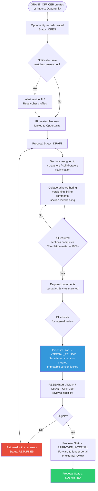

**Data flowing through pre-award:**

| Step | Data Created / Updated | Table |
|---|---|---|
| Opportunity created | `GrantOpportunity` record | `grant_opportunities` |
| Proposal created | `Proposal` (status=DRAFT), `ProposalVersion` v1 | `proposals`, `proposal_versions` |
| Section edited | `NarrativeSection` updated, new `ProposalVersion` on save | `narrative_sections` |
| Document uploaded | `ProposalDocument` with `virus_scan_status` | `proposal_documents` |
| Submission | `ProposalVersion` snapshot frozen, `Proposal` status → SUBMITTED | `proposals` |
| Internal review | `ApplicationStageHistory` entry | `application_stage_history` |

---

#### 16.3.2 Review, Scoring & Award Decision

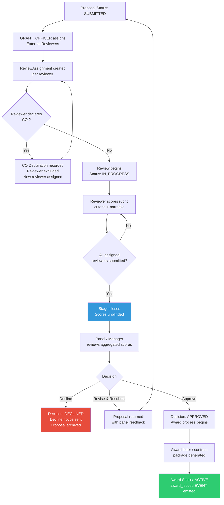

**Gate conditions before stage advance:**

| Gate | Condition Required |
|---|---|
| Review stage opens | Minimum 2 reviewers assigned, all COI declarations submitted |
| Scores unblinded | All assigned reviewers have submitted (or deadline passed) |
| Panel review | Quorum met (configurable minimum % of reviewers) |
| Award issued | Grant Officer AND Institution Admin approval (if amount > threshold) |

---

#### 16.3.3 Post-Award: Budget → Disbursement → Closeout

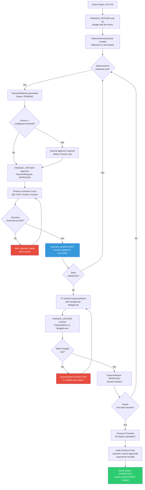

**Budget vs. actuals data flow:**
```
Finance ERP (QuickBooks / SAP / Oracle / Custom)
  │
  │  Nightly sync job (Celery Beat)
  │  → pulls transactions since last_sync_at
  │  → maps to FinancialActual records
  │  → checks idempotency_key (no duplicates)
  │
  ▼
FinancialActual table (DACORIS)
  │
  │  Budget variance calculation service
  │  → computes spent_to_date per BudgetLine
  │  → flags lines where spent > 80% (alert threshold)
  │  → computes projected overspend
  │
  ▼
Budget vs. Actuals Dashboard API
  → Real-time chart data for PI and Finance Officer
  → budget_alert EVENT if threshold breached
```

---

### 16.4 Intra-Module Workflow: Research Management

#### 16.4.1 Project Registration & Team Setup

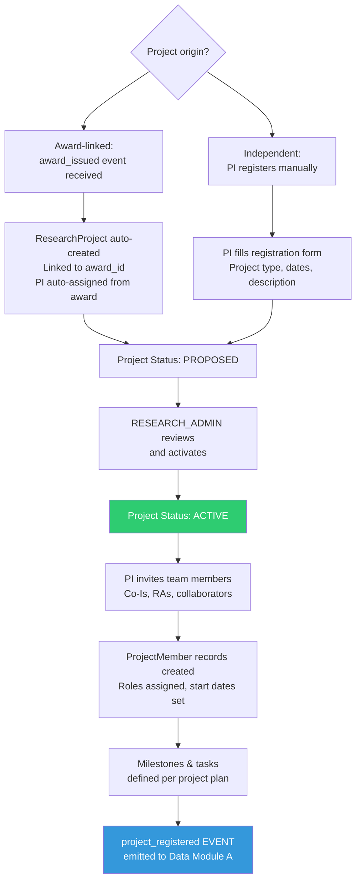

---

#### 16.4.2 Ethics / IRB Workflow

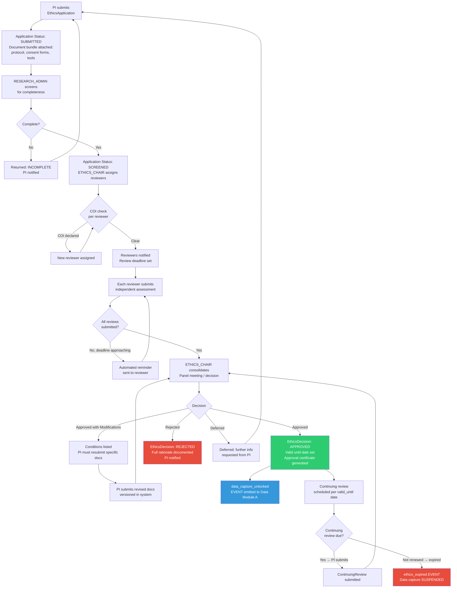

---

#### 16.4.3 Research Output Registration & Publication Pipeline

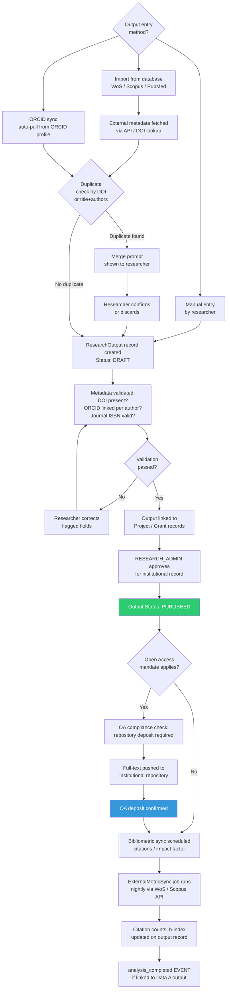

---

### 16.5 Intra-Module Workflow: Data Management Part A

#### 16.5.1 Form Design → Data Collection → Staging

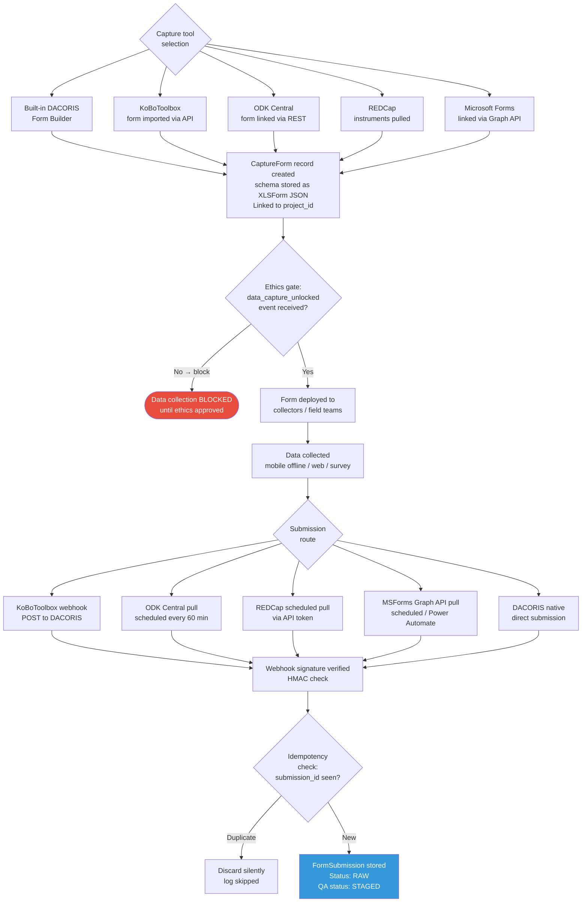

---

#### 16.5.2 QA Pipeline → Analysis → Repository

```mermaid
flowchart TD
    A[FormSubmission\nStatus: STAGED] --> B[QA Rule Engine runs\nper dataset QA rules]

    B --> C{Missing\nvalue check}
    C -- Fail --> D[Record flagged:\nMISSING_VALUE\nField identified]
    C -- Pass --> E{Duplicate\nrecord check}
    D --> E

    E -- Fail --> F[Record flagged:\nDUPLICATE\nCandidate match shown]
    E -- Pass --> G{Consistency\ncheck\ncross-field rules}
    F --> G

    G -- Fail --> H[Record flagged:\nINCONSISTENT\nRule and fields noted]
    G -- Pass --> I{Range &\nformat check}
    H --> I

    I -- Fail --> J[Record QUARANTINED\nQA Status: REJECTED]
    I -- Pass --> K[QA Status: PASSED]

    J --> L{Manual\nreview by\nDATA_STEWARD}
    L -- Override: accept --> K
    L -- Confirm: reject --> M[Record permanently\nexcluded with audit note]

    K --> N[Data Transformation\nRecoding, standardisation,\nderived variables]
    N --> O[Dataset version incremented\nchecksum computed\nDatasetVersion record created]
    O --> P{Analysis\nrequired?}
    P -- Yes --> Q[AnalysisWorkspace\nopened: R / Python]
    Q --> R[AnalysisRun executed\nin sandboxed container]
    R --> S[Outputs linked:\ntables, figures, reports\nto DatasetVersion]
    S --> T[analysis_completed EVENT]
    P -- No / After analysis --> U

    T --> U[Repository deposit initiated\nby DATA_STEWARD]
    U --> V[DataCite metadata\nform completed]
    V --> W{DOI\nregistration\navailable?}
    W -- Yes --> X[DOI minted via\nDataCite API\nDOI stored on record]
    W -- No --> Y[Handle / internal ID\nassigned instead]
    X --> Z
    Y --> Z[Access policy set:\nPublic / Restricted /\nEmbargoed / PHI]
    Z --> AA[RepositoryDataset record\nStatus: PUBLISHED\nOAI-PMH record generated]
    AA --> AB[dataset_curated EVENT\nemitted to Data Module B]

    style J fill:#e74c3c,color:#fff
    style K fill:#2ecc71,color:#fff
    style AA fill:#2ecc71,color:#fff
    style AB fill:#3498db,color:#fff
```

**QA pipeline data flow detail:**

```
Raw FormSubmissions (PostgreSQL: form_submissions)
  │
  ├── QA Rule Engine (Celery task)
  │     reads: QARule[] for dataset
  │     writes: QAResult[] per submission per rule
  │     updates: FormSubmission.qa_status
  │
  ├── Quarantine Zone
  │     qa_status = REJECTED
  │     visible only to DATA_STEWARD
  │     requires manual decision + AuditEvent
  │
  ├── Transformation Service
  │     reads: approved FormSubmissions
  │     applies: DataTransformation[] steps
  │     writes: new DatasetVersion with checksum
  │
  └── Analysis Workspace
        reads: specific DatasetVersion (immutable)
        writes: AnalysisRun, AnalysisOutput
        links: output → DatasetVersion + ProjectMilestone
```

---

### 16.6 Intra-Module Workflow: Data Management Part B

#### 16.6.1 Ingestion Pipeline (Batch & Streaming)

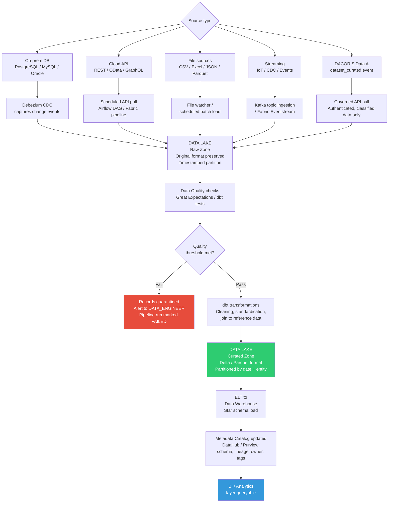

---

#### 16.6.2 Analytics Consumption & Feedback Loop

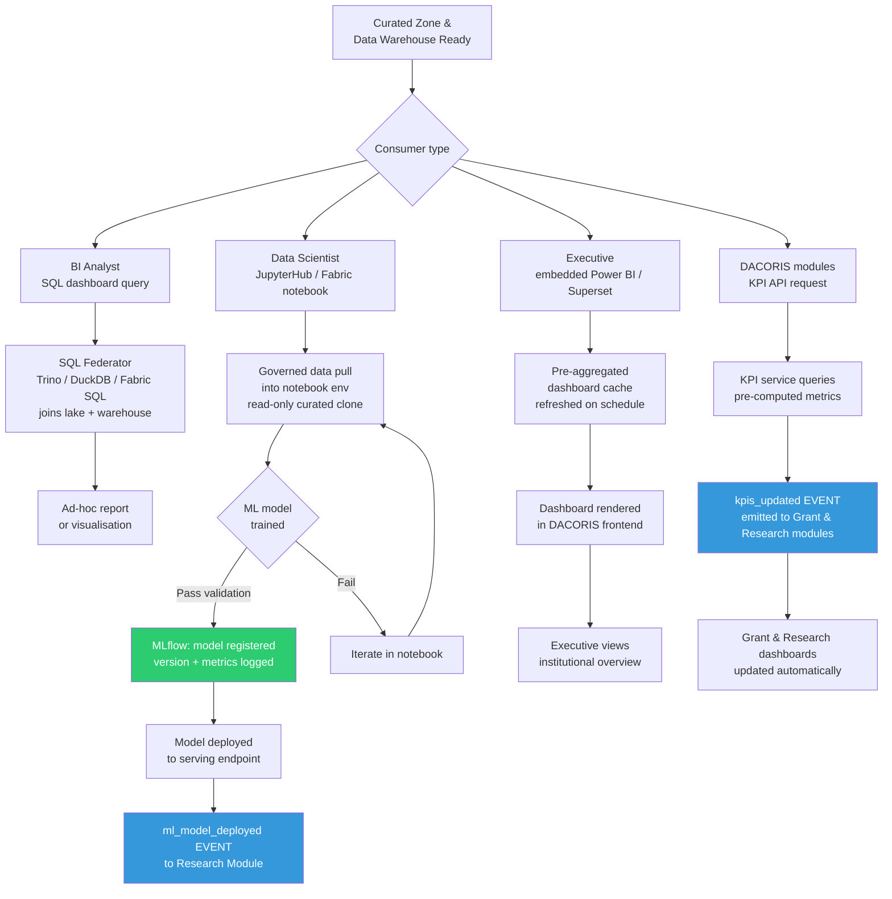

---

### 16.7 Cross-Module Data Flow Map

This diagram shows which data entities are shared across modules and the direction of flow.

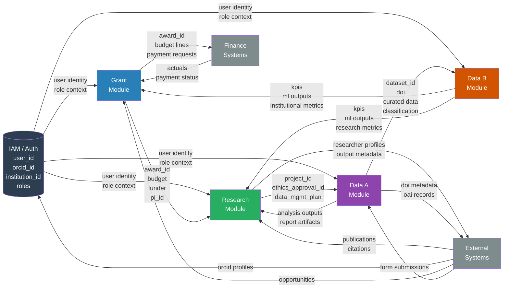

---

### 16.8 State Machine Summary

All major entities have defined status lifecycles. Transitions are enforced by the workflow engine — no direct status field updates via API without passing through the transition rules.

#### Grant Proposal States
```
DRAFT → INTERNAL_REVIEW → RETURNED → DRAFT        (revision cycle)
                        → APPROVED_INTERNAL
                             → SUBMITTED
                                  → UNDER_REVIEW
                                       → DECLINED  (terminal)
                                       → AWARDED
                                            → CONTRACTING
                                                 → ACTIVE
                                                      → COMPLETED (terminal)
                                                      → TERMINATED (terminal)
```

#### Ethics Application States
```
DRAFT → SUBMITTED → INCOMPLETE → DRAFT             (revision cycle)
                 → SCREENED
                      → UNDER_REVIEW
                           → APPROVED              → [continuing review loop]
                           → APPROVED_WITH_MODS → UNDER_REVIEW
                           → DEFERRED   → SUBMITTED
                           → REJECTED              (terminal)
                      → EXPIRED                    (terminal — if not renewed)
```

#### Dataset States (Data A)
```
STAGING → QA_FAILED → QUARANTINED → [manual review] → STAGING or REJECTED
        → QA_PASSED
             → ANALYSIS_READY
                  → CURATING
                       → EMBARGOED     (time-gated)
                       → PUBLISHED     (OAI-PMH, DOI assigned)
                            → RETRACTED (terminal, with reason)
```

#### Data Pipeline Run States (Data B)
```
PENDING → RUNNING → COMPLETED
                 → FAILED → RETRYING → COMPLETED
                                     → DEAD_LETTERED (alert sent)
        → CANCELLED
```

---

### 16.9 Notification Flow Map

This maps which workflow events trigger which notifications to which roles.

| Workflow Event | Notified Roles | Channel | Timing |
|---|---|---|---|
| Proposal submitted for internal review | GRANT_OFFICER, RESEARCH_ADMIN | Email + in-app | Immediate |
| Proposal returned to PI | PI, CO_I | Email + in-app | Immediate |
| Reviewer assigned | EXTERNAL_REVIEWER | Email | Immediate |
| Review overdue (>3 days before deadline) | EXTERNAL_REVIEWER | Email reminder | Scheduled |
| All reviews complete — panel ready | GRANT_OFFICER, ETHICS_CHAIR | In-app | Immediate |
| Award issued | PI, CO_I, FINANCE_OFFICER, RESEARCH_ADMIN | Email + in-app | Immediate |
| Ethics application submitted | ETHICS_CHAIR, RESEARCH_ADMIN | Email | Immediate |
| Ethics decision issued | PI, CO_I | Email + in-app | Immediate |
| Continuing review due in 30 days | PI | Email reminder | Scheduled |
| Ethics expired — capture suspended | PI, DATA_STEWARD, RESEARCH_ADMIN | Email (urgent) + in-app | Immediate |
| Data collection submission received | DATA_STEWARD | In-app (batch digest) | Hourly |
| QA rule failure — quarantined records | DATA_STEWARD | Email | Immediate |
| Dataset published (DOI minted) | PI, DATA_STEWARD | Email + in-app | Immediate |
| Budget burn > 80% | PI, FINANCE_OFFICER | Email (alert) + in-app | Immediate |
| Payment approved | PI, FINANCE_OFFICER | In-app | Immediate |
| Payment failed in ERP | FINANCE_OFFICER | Email (urgent) | Immediate |
| Expense report rejected | PI, CO_I | Email + in-app | Immediate |
| Award closeout complete | PI, GRANT_OFFICER, FINANCE_OFFICER | Email | Immediate |
| KPIs updated (weekly) | INSTITUTIONAL_LEAD | Email digest | Scheduled (weekly) |
| ML model deployed | DATA_ENGINEER, PI (if linked) | In-app | Immediate |

---

| Version | Date | Changes |
|---|---|---|
| 1.0 | March 2026 | Initial comprehensive plan — all modules, roles, integrations, roadmap |
| 1.1 | March 2026 | Confirmed: Hybrid deployment · All 4 capture tools · All 4 finance systems. Added full per-system finance connector specs, hybrid architecture with workload placement, on-prem specs, VPN boundary, 3-2-1 backup |
| 1.2 | March 2026 | Confirmed: Module priority order (Grants→Research→DataA→DataB) · Data Part B: full Fabric vs. open-source comparison with side-by-side table, decision framework, phased hybrid recommendation, and stack-agnostic sub-modules |

---

*All major architectural decisions are now confirmed. This plan is ready for sprint planning. Next action: share GitHub repo URL for code alignment review, then begin Phase 0 (Foundation Hardening).*

## Document Version History

| Version | Date | Changes |
|---|---|---|
| 1.0 | March 2026 | Initial comprehensive plan — all modules, roles, integrations, roadmap |
| 1.1 | March 2026 | Confirmed: Hybrid deployment · All 4 capture tools · All 4 finance systems. Full connector specs, hybrid architecture, workload placement, VPN boundary, 3-2-1 backup |
| 1.2 | March 2026 | Confirmed: Module priority order · Data Part B: Fabric vs. open-source full comparison with decision framework |
| 1.3 | March 2026 | Added Section 16 — complete intra-module and inter-module workflows and data flows: master lifecycle flowchart, 16-event inter-module catalogue, Grant pre-award/review/post-award flows, Research project/ethics/outputs flows, Data A capture/QA/repository flows, Data B ingestion/analytics flows, cross-module data flow map, state machine summary, notification flow map |

---

*All major architectural decisions are now confirmed. This plan is ready for sprint planning. Next action: share GitHub repo URL for code alignment review, then begin Phase 0 (Foundation Hardening).*
